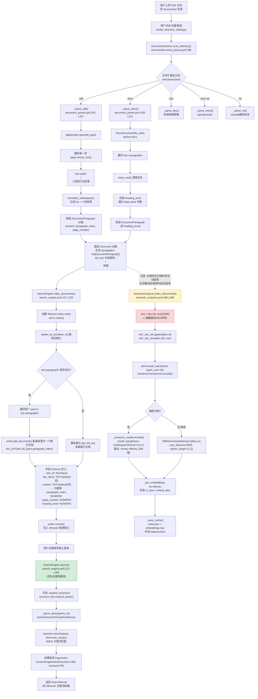

# RAG 系统深度分析报告

> 基于辩论赛智能备赛助手（DebatePrep）实际代码的架构分析

---

## 一、PDF 上传到语义可搜索的完整数据处理流水线

### 1.1 核心发现：双索引架构现状

**⚠️ 关键架构事实：当前系统存在两套完全独立的索引系统，二者并未真正打通用于检索：**

| 索引系统 | 实现文件 | 索引粒度 | 是否用于主搜索 | 向量/分词方式 | 存储位置 |
|---------|---------|---------|--------------|-------------|---------|
| **Whoosh 关键词索引** | [search_engine.py](file:///Users/huwenjie/项目/gsb/label-00208/backend/app/services/search_engine.py) | 段落级 | ✅ 是（主搜索） | jieba 分词 + BM25 | `data/index/` |
| **SemanticAnalyzer 语义向量** | [semantic_analyzer.py](file:///Users/huwenjie/项目/gsb/label-00208/backend/app/services/semantic_analyzer.py) | **文档级（截断前5000字）** | ❌ 否（仅用于概念联想/立场分析） | paraphrase-multilingual-MiniLM-L12-v2 | `data/vectors/` |

用户点击"扫描目录"按钮触发的流程入口为 [documents_page.py#L72-L118](file:///Users/huwenjie/项目/gsb/label-00208/backend/app/views/documents_page.py#L72-L118) 中的 `scan_documents()`。

### 1.2 完整数据流图（Mermaid Flowchart）



### 1.3 各阶段关键函数与参数明细

#### 阶段1：文件解析（以 PDF 为例）
| 步骤 | 函数/方法 | 文件位置 | 关键参数 |
|-----|----------|---------|---------|
| 入口分发 | `DocumentParser.parse(file_path)` | [document_parser.py#L44-L69](file:///Users/huwenjie/项目/gsb/label-00208/backend/app/services/document_parser.py#L44-L69) | 按 `.suffix.lower()` 选择解析器 |
| PDF 打开 | `pdfplumber.open(file_path)` | [document_parser.py#L310](file:///Users/huwenjie/项目/gsb/label-00208/backend/app/services/document_parser.py#L310) | - |
| 文本提取 | `page.extract_text()` | [document_parser.py#L315](file:///Users/huwenjie/项目/gsb/label-00208/backend/app/services/document_parser.py#L315) | 默认参数（无 layout 分析，无 x_tolerance/y_tolerance 调整）|
| 段落分割 | `text.split("\n\n")` | [document_parser.py#L320](file:///Users/huwenjie/项目/gsb/label-00208/backend/app/services/document_parser.py#L320) | 按**连续空行**硬分割 |
| 空白标准化 | `normalize_whitespace(para_text)` | [text_utils.py#L19-L28](file:///Users/huwenjie/项目/gsb/label-00208/backend/app/utils/text_utils.py#L19-L28) | 行内多空白→单空格，去除首尾空白 |
| 短段过滤 | `len(para_text) < 3` 则 continue | [document_parser.py#L324](file:///Users/huwenjie/项目/gsb/label-00208/backend/app/services/document_parser.py#L324) | **丢弃长度小于3字符的段落** |

#### 阶段2：Whoosh 关键词索引构建
| 步骤 | 函数/方法 | 文件位置 | 关键参数 |
|-----|----------|---------|---------|
| Schema 定义 | `Schema(doc_id, file_name, content, ...)` | [search_engine.py#L80-L90](file:///Users/huwenjie/项目/gsb/label-00208/backend/app/services/search_engine.py#L80-L90) | `content` 字段使用 `JiebaTokenizer` |
| 中文分词 | `JiebaTokenizer.__call__()` | [search_engine.py#L29-L65](file:///Users/huwenjie/项目/gsb/label-00208/backend/app/services/search_engine.py#L29-L65) | 调用 `jieba.cut_for_search(value)`（搜索引擎模式分词）|
| 索引存储 | `index.create_in / index.open_dir` | [search_engine.py#L95-L102](file:///Users/huwenjie/项目/gsb/label-00208/backend/app/services/search_engine.py#L95-L102) | 目录：`config.INDEX_DIR = data/index` |
| 批量写入 | `writer.add_document()` 循环 | [search_engine.py#L186-L198](file:///Users/huwenjie/项目/gsb/label-00208/backend/app/services/search_engine.py#L186-L198) | 每个段落独立 doc_id：`{doc.id}_{para.paragraph_index}` |

#### 阶段3：语义向量构建（**未接入主搜索**）
| 步骤 | 函数/方法 | 文件位置 | 关键参数 |
|-----|----------|---------|---------|
| 文本截断 | `doc.full_text[:5000]` | [semantic_analyzer.py#L468](file:///Users/huwenjie/项目/gsb/label-00208/backend/app/services/semantic_analyzer.py#L468) | **硬截断，丢失5000字后内容** |
| Embedding 模型 | `SentenceTransformer(_model_name)` | [semantic_analyzer.py#L58](file:///Users/huwenjie/项目/gsb/label-00208/backend/app/services/semantic_analyzer.py#L58) | 模型名：`paraphrase-multilingual-MiniLM-L12-v2`（384维，多语言通用句向量）|
| 批量编码 | `model.encode(texts, batch_size=32)` | [semantic_analyzer.py#L191-L196](file:///Users/huwenjie/项目/gsb/label-00208/backend/app/services/semantic_analyzer.py#L191-L196) | `convert_to_numpy=True`, `show_progress_bar=True` |
| 缓存存储 | `np.save(embeddings.npy)` + `json.dump(meta.json)` | [semantic_analyzer.py#L492-L503](file:///Users/huwenjie/项目/gsb/label-00208/backend/app/services/semantic_analyzer.py#L492-L503) | 目录：`config.VECTOR_DIR = data/vectors` |

---

## 二、当前文本分块（Chunking）策略的问题与改进方案

### 2.1 当前分块策略的实际代码逻辑

通过阅读代码确认：**当前系统根本不存在真正意义上的"固定大小分块器"**，所谓分块完全依赖文档解析时自然形成的段落边界：

```python
# PDF 解析: document_parser.py#L320
page_paragraphs = text.split("\n\n")

# DOCX 解析: document_parser.py#L174
for idx, para in enumerate(docx.paragraphs):   # 直接使用 Word 段落

# TXT 解析: document_parser.py#L371
para_texts = content.split("\n\n")

# Excel 解析: document_parser.py#L291
text = " | ".join(cell for cell in row if cell)  # 每行→一个段落
```

此外，[SemanticAnalyzer.index_documents()](file:///Users/huwenjie/项目/gsb/label-00208/backend/app/services/semantic_analyzer.py#L448-L488) 则是**整篇文档截断到5000字符作为一个"块"**，粒度更粗。

### 2.2 问题一：块大小分布极度不均，长段落语义稀释，短段落信息不足

**问题分析：**

当前以自然段落为块，导致：
- PDF 中 `pdfplumber` 提取文本时，经常把一整页内容合并为一段（因为 PDF 没有原生段落概念，取决于排版），导致块可能长达数千字；
- 短段落（如列表项、小标题、数据行）可能只有几个字，单独作为块缺乏上下文；
- [document_parser.py#L324](file:///Users/huwenjie/项目/gsb/label-00208/backend/app/services/document_parser.py#L324) 甚至直接丢弃了 `len(para_text) < 3` 的段落，可能丢失"是""否"等关键辩论短答。

**改进方案：句子感知滑动窗口分块（Sentence-Aware Sliding Window）**

在 `backend/app/services/` 下新增 `chunking.py`（在 `DocumentParser` 解析后、`SearchEngine.index_document()` 前调用）：

```python
# ===== 建议新增文件: backend/app/services/chunking.py =====
import re
from dataclasses import dataclass
from typing import Optional
from app.models.document import Document, DocumentParagraph

@dataclass
class ChunkConfig:
    chunk_size: int = 512        # 目标块大小（字符数）
    chunk_overlap: int = 100     # 重叠字符数
    min_chunk_size: int = 30     # 最小块大小
    # 按中/英文句末标点切分
    sentence_endings: str = r'[。！？\.!?；;]+'

def split_into_sentences(text: str) -> list[str]:
    parts = re.split(ChunkConfig.sentence_endings, text)
    sentences = []
    for s in parts:
        s = s.strip()
        if s:
            sentences.append(s)
    return sentences

def chunk_document_paragraphs(
    doc: Document,
    config: ChunkConfig = ChunkConfig()
) -> list[DocumentParagraph]:
    """
    将原始段落重新分块为语义完整、大小均匀的块。

    策略：
    1. 保留文档结构：遇到 heading（heading_level 不为 None）优先作为块边界；
    2. 句子边界感知：永远不在句子中间切分，找到最接近 chunk_size 的句末；
    3. 滑动窗口重叠：相邻块共享 chunk_overlap 字符的上下文。
    """
    new_chunks: list[DocumentParagraph] = []
    chunk_idx = 0
    buffer = ""
    current_page: Optional[int] = None
    current_heading: Optional[int] = None

    # 用于 overlap 回溯：记录最近几句话
    overlap_sentences: list[str] = []

    for para in doc.paragraphs:
        # 遇到标题时：先 flush 当前 buffer，再把标题作为独立块的开头
        if para.is_heading and buffer.strip():
            # flush 之前的累积内容
            if buffer.strip():
                new_chunks.append(DocumentParagraph(
                    content=buffer.strip(),
                    paragraph_index=chunk_idx,
                    page_number=current_page,
                    heading_level=current_heading,
                ))
                chunk_idx += 1
            buffer = para.content  # 标题本身先放入新块起始
            current_heading = para.heading_level
            current_page = para.page_number
            overlap_sentences = []
            continue

        current_page = current_page or para.page_number
        sentences = split_into_sentences(para.content)

        for sent in sentences:
            candidate = (buffer + sent).strip()
            if len(candidate) <= config.chunk_size:
                buffer = candidate + "。" if sent and sent[-1] not in "。！？.!?；;" else candidate
            else:
                # 当前块达到阈值：保存
                if len(buffer.strip()) >= config.min_chunk_size:
                    new_chunks.append(DocumentParagraph(
                        content=buffer.strip(),
                        paragraph_index=chunk_idx,
                        page_number=current_page,
                        heading_level=current_heading,
                    ))
                    chunk_idx += 1
                    # 使用 overlap 上下文初始化下一个块
                    overlap_text = ""
                    overlap_char_count = 0
                    for osent in reversed(overlap_sentences):
                        if overlap_char_count + len(osent) > config.chunk_overlap:
                            break
                        overlap_text = osent + "。" + overlap_text
                        overlap_char_count += len(osent) + 1
                    buffer = overlap_text + sent
                else:
                    # 当前 buffer 太短（极端情况），继续累积
                    buffer = candidate
            # 更新 overlap 句子窗口
            overlap_sentences.append(sent)
            if len(overlap_sentences) > 8:
                overlap_sentences = overlap_sentences[-8:]

    if buffer.strip() and len(buffer.strip()) >= config.min_chunk_size:
        new_chunks.append(DocumentParagraph(
            content=buffer.strip(),
            paragraph_index=chunk_idx,
            page_number=current_page,
            heading_level=current_heading,
        ))

    return new_chunks
```

**集成位置：** 在 [documents_page.py#L104](file:///Users/huwenjie/项目/gsb/label-00208/backend/app/views/documents_page.py#L104) `engine.index_documents(documents, ...)` 之前，对每个 `doc` 调用 `doc.paragraphs = chunk_document_paragraphs(doc)` 替换原始段落。

### 2.3 问题二：块之间零重叠（No Overlap）导致跨块语义丢失

**问题分析：**

当前 [SearchEngine.index_document()](file:///Users/huwenjie/项目/gsb/label-00208/backend/app/services/search_engine.py#L104-L155) 中每个段落作为独立索引单元，doc_id 为 `{doc.id}_{para.paragraph_index}`，相邻段落之间**没有任何重叠**。如果一个论据跨越两个自然段落（如第一段描述数据，第二段得出结论），搜索时无论匹配到哪一段，都可能丢失另一半关键信息。

[Whoosh 的 ContextFragmenter](file:///Users/huwenjie/项目/gsb/label-00208/backend/app/services/search_engine.py#L274-L276)（`maxchars=300, surround=50`）只能在**单个索引文档内部**做高亮片段提取，无法跨段落召回。

**改进方案：父子块（Parent-Child Chunk）双索引**

在分块时除了生成细粒度的子块（child chunk）用于检索，还为每个子块关联一个更大的父上下文块（parent chunk，由相邻 2-3 个子块合并而成）。检索时先命中子块，返回父块给 LLM：

```python
# 在 chunking.py 中追加
@dataclass
class ChunkWithParent(DocumentParagraph):
    """扩展：带父块上下文的块"""
    parent_content: str = ""      # 父块完整内容（送给 LLM）
    parent_start: int = 0         # 子块在父块中的起始位置

def build_parent_chunks(
    chunks: list[DocumentParagraph],
    parent_window: int = 3   # 每 N 个子块组成一个父块
) -> list[ChunkWithParent]:
    result: list[ChunkWithParent] = []
    n = len(chunks)
    for i in range(n):
        start = max(0, i - (parent_window // 2))
        end = min(n, i + (parent_window - parent_window // 2))
        parent_chunks = chunks[start:end]
        parent_text = "\n\n".join(c.content for c in parent_chunks)
        # 计算当前子块在父块中的位置
        offset = sum(len(c.content) + 2 for c in parent_chunks[0:i-start])
        result.append(ChunkWithParent(
            content=chunks[i].content,
            paragraph_index=chunks[i].paragraph_index,
            heading_level=chunks[i].heading_level,
            page_number=chunks[i].page_number,
            parent_content=parent_text,
            parent_start=offset,
        ))
    return result
```

**Whoosh Schema 扩展：** 在 [search_engine.py#L80-L90](file:///Users/huwenjie/项目/gsb/label-00208/backend/app/services/search_engine.py#L80-L90) Schema 中新增字段：

```python
parent_content = TEXT(stored=True, analyzer=create_jieba_analyzer())
```

检索命中后，结果展示和送给下游 LLM 的内容使用 `parent_content` 而非 `content`。

### 2.4 问题三：未充分利用文档结构（标题层级、列表、表格）

**问题分析：**

代码中存在以下"半成品"信号：

1. **DOCX 的标题检测已实现但未被利用**：[document_parser.py#L180-L190](file:///Users/huwenjie/项目/gsb/label-00208/backend/app/services/document_parser.py#L180-L190) 正确识别了 heading_level（1-6），但在 [SearchEngine](file:///Users/huwenjie/项目/gsb/label-00208/backend/app/services/search_engine.py#L88) 中 `heading_level` 只是 `STORED`/`NUMERIC`，既没有加入搜索字段，也没有用于分块边界判断；
2. **PDF 完全不感知结构**：`pdfplumber` 具备 `extract_words()`、`.find_tables()` 能力，但代码只用了 `page.extract_text()`，丢失了标题字号差异、表格、列表编号等结构信息；
3. **Excel 表格被拍平为 `|` 分隔的一行**：丢失了列名→行值的键值结构，语义弱；
4. **列表项（如"1. ... 2. ..."、"- ..."）没有被识别**：每个列表项被当作普通段落或被合并，论据点之间的边界消失。

**改进方案：结构感知解析 + 标题路径增强（Contextual Enrichment）**

核心思想：每个小块在向量化/索引之前，把其所属的标题层级路径（breadcrumb）前置到块文本中，例如：

> 【一、年轻人就业现状 > 1.1 失业率数据 > 城镇青年失业率】2024年7月，16-24岁城镇青年调查失业率达到19.9%...

**(1) 增强 DocumentParagraph 模型：** 在 [document.py#L9-L19](file:///Users/huwenjie/项目/gsb/label-00208/backend/app/models/document.py#L9-L19) 中扩展字段（保持向后兼容）：

```python
@dataclass
class DocumentParagraph:
    content: str
    paragraph_index: int
    heading_level: Optional[int] = None
    page_number: Optional[int] = None
    # 新增：
    heading_path: list[str] = field(default_factory=list)   # 面包屑标题路径
    is_list_item: bool = False
    is_table_row: bool = False
    enriched_content: str = ""    # 拼接了 heading_path 的增强文本
```

**(2) PDF 结构解析升级：** 改进 [_parse_pdf()](file:///Users/huwenjie/项目/gsb/label-00208/backend/app/services/document_parser.py#L301-L347)：

```python
def _parse_pdf_enhanced(self, file_path: str) -> Optional[Document]:
    doc = self._create_base_document(file_path, "pdf")
    paragraphs = []
    paragraph_idx = 0
    heading_stack: dict[int, str] = {}   # level -> heading text

    with pdfplumber.open(file_path) as pdf:
        doc.page_count = len(pdf.pages)
        for page_num, page in enumerate(pdf.pages, start=1):
            # (a) 尝试抽取表格并结构化存储
            tables = page.extract_tables()
            for table in tables:
                if not table or not table[0]:
                    continue
                header = table[0]
                for row in table[1:]:
                    row_kv = "；".join(
                        f"{h.strip()}: {c.strip()}" for h, c in zip(header, row)
                        if h and c
                    )
                    if row_kv:
                        paragraphs.append(DocumentParagraph(
                            content=row_kv, paragraph_index=paragraph_idx,
                            page_number=page_num, is_table_row=True,
                        ))
                        paragraph_idx += 1

            # (b) 按行解析，通过字号/粗体启发式识别标题
            words = page.extract_words(extra_attrs=["fontname", "size"])
            # 按行聚合，计算每行的 max font size
            lines = {}
            for w in words:
                key = round(w["top"], 0)
                lines.setdefault(key, []).append(w)
            # 对行按 size 降序，识别标题
            # ... (行聚类逻辑省略，核心：size 大于正文平均且行短 → heading)
            # 最终构造 paragraphs，对每个 paragraph 维护 heading_stack
    return doc
```

**(3) 标题路径填充（在文档解析完成后、分块前统一处理）：**

```python
def enrich_chunks_with_headings(doc: Document) -> None:
    """对 docx 等已识别 heading 的文档，将标题路径注入每个段落"""
    heading_stack: dict[int, str] = {}
    for para in doc.paragraphs:
        if para.heading_level is not None:
            # 清空更深层级
            for l in list(heading_stack.keys()):
                if l >= para.heading_level:
                    del heading_stack[l]
            heading_stack[para.heading_level] = para.content
        ordered_headings = [heading_stack[k] for k in sorted(heading_stack.keys())]
        para.heading_path = ordered_headings
        if ordered_headings:
            breadcrumb = " > ".join(ordered_headings)
            para.enriched_content = f"【{breadcrumb}】{para.content}"
        else:
            para.enriched_content = para.content
```

**集成位置：** `enrich_chunks_with_headings(doc)` 在 `DocumentParser` 返回 Document 后立即调用；索引时 [SearchEngine 写入 content 字段](file:///Users/huwenjie/项目/gsb/label-00208/backend/app/services/search_engine.py#L130) 使用 `para.enriched_content` 而非 `para.content`。

---

## 三、语义检索 Recall 不足的根因分析与提升方案

### 3.1 当前检索架构的实际问题（基于代码实证）

通过追踪 [search_page.py#L89-L122](file:///Users/huwenjie/项目/gsb/label-00208/backend/app/views/search_page.py#L89-L122) 的 `perform_search()` 调用链，得出以下事实：

| 问题编号 | 问题现象 | 代码位置 | 影响 |
|---------|---------|---------|-----|
| **R1** | **语义向量索引完全没接入主搜索路径** | [search_page.py#L104-L107](file:///Users/huwenjie/项目/gsb/label-00208/backend/app/views/search_page.py#L104-L107) 只调用 `engine.search()`（Whoosh），未调用 `SemanticAnalyzer.semantic_search()` | "语义搜索"名不副实，本质是关键词 BM25 |
| **R2** | **语义向量以整篇文档为粒度**，不是段落/块级 | [semantic_analyzer.py#L468](file:///Users/huwenjie/项目/gsb/label-00208/backend/app/services/semantic_analyzer.py#L468) `doc.full_text[:5000]` | 一篇长文档只用一个向量表示，细粒度论据无法被定位；且5000字后内容完全丢失 |
| **R3** | **Embedding 模型选型受限** | [semantic_analyzer.py#L28](file:///Users/huwenjie/项目/gsb/label-00208/backend/app/services/semantic_analyzer.py#L28) `paraphrase-multilingual-MiniLM-L12-v2` | 该模型为多语言通用句向量模型，未针对中文长文本检索微调；中文检索质量弱于专用中文嵌入模型（如 `bge-large-zh-v1.5`、`m3e-base`、`piccolo-base-zh`）|
| **R4** | **无查询重写/扩展（仅支持预定义同义词）** | [search_engine.py#L247-L250](file:///Users/huwenjie/项目/gsb/label-00208/backend/app/services/search_engine.py#L247-L250) `synonym_dict.expand_query()` 依赖硬编码词典；且 `expand_synonyms` 参数在 UI 层默认关闭 | 用户查询"躺平"无法扩展到"佛系""内卷""低欲望"等语义相关词，召回严重受限 |
| **R5** | **无混合检索** | 无 BM25 + 向量的倒数排序融合（RRF）或线性加权 | 关键词匹配（处理专有名词强）和语义匹配（处理同义改写强）互为补充但未融合 |
| **R6** | **无重排序（Rerank）** | [search_engine.py#L280-L299](file:///Users/huwenjie/项目/gsb/label-00208/backend/app/services/search_engine.py#L280-L299) 直接按 Whoosh 分数输出 | BM25 分数对长查询、语义相关性排序不准，缺少 Cross-Encoder 精排 |
| **R7** | **相似度阈值与结果截断策略单一** | [config.py#L25](file:///Users/huwenjie/项目/gsb/label-00208/backend/app/config.py#L25) `SIMILARITY_THRESHOLD=0.3` 硬编码；`MAX_RESULTS=50` | 阈值不随查询自适应，top_k 截断没有根据相关性分布动态调整 |

### 3.2 提升方案一：混合检索（BM25 + 向量）+ 段落级向量索引

这是提升 recall 的基础改造。核心：
1. 将语义向量索引粒度从文档级改为**块级/段落级**；
2. 检索时并行执行 BM25 和向量检索，两路结果用 RRF 融合。

#### (a) 改造 SemanticAnalyzer 为块级向量索引

修改 [SemanticAnalyzer.index_documents()](file:///Users/huwenjie/项目/gsb/label-00208/backend/app/services/semantic_analyzer.py#L448-L488)：

```python
def index_documents(self, documents: list[Document], progress_callback=None) -> int:
    self._chunk_ids = []        # 格式: {doc_id}_{para_idx}
    self._chunk_texts = {}      # chunk_id -> enriched_content
    self._chunk_metadata = {}   # chunk_id -> {file_name, page, heading_path...}

    texts = []
    for doc in documents:
        for para in doc.paragraphs:
            chunk_id = f"{doc.id}_{para.paragraph_index}"
            content_for_embed = getattr(para, "enriched_content", para.content)
            self._chunk_ids.append(chunk_id)
            self._chunk_texts[chunk_id] = content_for_embed
            self._chunk_metadata[chunk_id] = {
                "doc_id": doc.id,
                "file_name": doc.file_name,
                "file_path": doc.file_path,
                "file_type": doc.file_type,
                "paragraph_index": para.paragraph_index,
                "page_number": para.page_number,
                "heading_level": para.heading_level,
                "raw_content": para.content,
            }
            texts.append(content_for_embed)

    if texts:
        self._chunk_embeddings = self.encode_batch(texts, batch_size=32)
    self._save_cache()
    return len(texts)
```

**缓存格式升级**：`meta.json` 中存储 chunk 级别 id→text→metadata；`embeddings.npy` 形状由 `(n_docs, dim)` 变为 `(n_chunks, dim)`。

#### (b) 添加向量检索方法

在 SemanticAnalyzer 中新增：

```python
def vector_search(self, query: str, top_k: int = 30) -> list[tuple[str, float]]:
    if self._chunk_embeddings is None or len(self._chunk_embeddings) == 0:
        return []
    q_emb = self.encode_single(query)
    if len(q_emb) == 0:
        return []
    # 批量余弦相似度
    sims = np.dot(self._chunk_embeddings, q_emb) / (
        np.linalg.norm(self._chunk_embeddings, axis=1) * np.linalg.norm(q_emb) + 1e-9
    )
    # 取 top_k
    top_idx = np.argsort(-sims)[:top_k]
    return [(self._chunk_ids[i], float(sims[i])) for i in top_idx if sims[i] > 0.15]
```

#### (c) RRF（Reciprocal Rank Fusion）融合

新建 `backend/app/services/hybrid_search.py`：

```python
def reciprocal_rank_fusion(
    bm25_results: list[tuple[str, float]],
    vector_results: list[tuple[str, float]],
    k: int = 60,
) -> list[tuple[str, float]]:
    """
    RRF 融合公式: score(d) = Σ 1/(k + rank_i(d))
    无需校准两路分数，鲁棒性强。
    """
    scores: dict[str, float] = {}
    for rank, (doc_id, _) in enumerate(bm25_results):
        scores[doc_id] = scores.get(doc_id, 0.0) + 1.0 / (k + rank + 1)
    for rank, (doc_id, _) in enumerate(vector_results):
        scores[doc_id] = scores.get(doc_id, 0.0) + 1.0 / (k + rank + 1)
    return sorted(scores.items(), key=lambda x: x[1], reverse=True)
```

**集成位置：** 在 [SearchEngine.search()](file:///Users/huwenjie/项目/gsb/label-00208/backend/app/services/search_engine.py#L222-L305) 末尾、返回 results 之前，插入混合检索逻辑：

```python
# search_engine.py search() 方法末尾（替换原 for hit in search_results 循环前）
# === 新增混合检索 ===
if self._hybrid_enabled:
    analyzer = SemanticAnalyzer()
    vector_hits = analyzer.vector_search(query_str, top_k=30)
    bm25_hits = [(hit["doc_id"], hit.score) for hit in search_results]
    fused = reciprocal_rank_fusion(bm25_hits, vector_hits)
    # 用 fused 顺序重排 search_results，缺失的从 vector_hits 补充
    # ...（按 fused id 顺序组装 SearchResultItem）
```

更彻底的做法：新建 `HybridSearchEngine` 类组合 `SearchEngine` 和 `SemanticAnalyzer`，在 [search_page.py#get_search_engine()](file:///Users/huwenjie/项目/gsb/label-00208/backend/app/views/search_page.py#L125-L129) 替换。

### 3.3 提升方案二：查询重写与语义扩展（Query Rewriting）

当前系统查询扩展仅依赖 [synonym_dict.py](file:///Users/huwenjie/项目/gsb/label-00208/backend/app/utils/synonym_dict.py)（硬编码词典），覆盖度极低。

**(a) 基于 Embedding 的查询扩展**：利用已加载的 SentenceTransformer，将查询向量与语料中所有 chunk 的关键词做语义相似度匹配，动态扩展出查询的同义表达。在 `SemanticAnalyzer` 中添加：

```python
def expand_query_with_semantic_keywords(
    self, query: str, top_k: int = 6
) -> list[str]:
    # 取 index_chunks 中所有 chunk 提取的高频词（缓存），用词向量做相似度
    if not hasattr(self, "_keyword_embeddings_cache"):
        self._build_keyword_cache()
    q_emb = self.encode_single(query)
    sims = np.dot(self._keyword_embeddings_cache, q_emb)
    top_idx = np.argsort(-sims)[:top_k]
    return [self._keyword_vocab[i] for i in top_idx if sims[i] > 0.5]

def _build_keyword_cache(self):
    import jieba.analyse
    vocab = set()
    for cid, text in self._chunk_texts.items():
        for w, _ in jieba.analyse.extract_tags(text, topK=10, withWeight=True):
            if len(w) >= 2:
                vocab.add(w)
    self._keyword_vocab = list(vocab)
    self._keyword_embeddings_cache = self.encode_batch(self._keyword_vocab)
```

**(b) 查询多路生成（可选，若将来接入 LLM）**：
```
原查询 Q → LLM 生成:
  Q1: 用辩论学术语改写 Q
  Q2: 从反方立场可能会如何表达类似含义
  Q3: Q 涉及的核心概念关键词列表
```
将 Q、Q1、Q2、Q3 分别做检索后结果合并去重。

**集成位置：** [search_engine.py#L244-L254](file:///Users/huwenjie/项目/gsb/label-00208/backend/app/services/search_engine.py#L244-L254) 替换/补充现有的同义词扩展：

```python
if expand_synonyms:
    analyzer = SemanticAnalyzer()
    # 1) 预定义同义词
    expanded = synonym_dict.expand_query(query_str)
    # 2) 语义扩展关键词
    sem_terms = analyzer.expand_query_with_semantic_keywords(original_query, top_k=5)
    # 合并到 Or 查询
    expanded_terms = synonym_dict.get_all_synonyms_for_query(original_query) + sem_terms
    query_str = f"{original_query} {' '.join(sem_terms)}"
```

### 3.4 提升方案三：Cross-Encoder 重排序（Rerank）

向量检索和 BM25 检索是 bi-encoder 架构（查询与文档独立编码），速度快但精度有限。Cross-encoder 将查询和文档拼接后输入模型打分，精度显著更高。

**(a) 引入轻量中文 reranker**：推荐 `bge-reranker-base` 或 `bge-reranker-v2-m3`（中文表现优秀，模型 ~300MB）。

在 `SemanticAnalyzer` 或新建 `Reranker` 服务中添加：

```python
# backend/app/services/reranker.py
import numpy as np

_reranker_model = None

def get_reranker():
    global _reranker_model
    if _reranker_model is None:
        try:
            from sentence_transformers import CrossEncoder
            _reranker_model = CrossEncoder("BAAI/bge-reranker-base")
        except Exception as e:
            return None
    return _reranker_model

def rerank(query: str, documents: list[tuple[str, str]], top_n: int = 10):
    """
    documents: [(chunk_id, content), ...]
    Returns: [(chunk_id, rerank_score)] 按分数降序
    """
    model = get_reranker()
    if model is None or not documents:
        return [(cid, 0.0) for cid, _ in documents][:top_n]
    pairs = [(query, content) for _, content in documents]
    scores = model.predict(pairs)
    ranked = sorted(
        zip([cid for cid, _ in documents], scores),
        key=lambda x: x[1], reverse=True
    )
    return ranked[:top_n]
```

**(b) 集成位置：在混合检索返回粗排结果后**，在 [SearchEngine.search()](file:///Users/huwenjie/项目/gsb/label-00208/backend/app/services/search_engine.py#L222-L305) 末尾：

```python
from app.services.reranker import rerank

# === 粗排后重排序 ===
# 粗排取 top 50 输入 reranker
candidate_pairs = []
for hit in search_results:
    content = hit.get("content", "")
    candidate_pairs.append((hit["doc_id"], content))
if hasattr(self, "_analyzer") and self._analyzer._chunk_metadata:
    for cid, _ in vector_hits[:50]:
        if cid not in [p[0] for p in candidate_pairs]:
            candidate_pairs.append((cid, self._analyzer._chunk_texts[cid]))

candidate_pairs = candidate_pairs[:50]
reranked = rerank(query_str, candidate_pairs, top_n=max_results)

# 根据 reranked 顺序组装 SearchResultItem（通过 chunk_metadata 查文件信息）
for rank, (cid, score) in enumerate(reranked):
    meta = analyzer._chunk_metadata.get(cid, {})
    content = analyzer._chunk_texts.get(cid, "")
    item = SearchResultItem(
        doc_id=cid,
        file_path=meta.get("file_path", ""),
        file_name=meta.get("file_name", ""),
        file_type=meta.get("file_type", ""),
        content=meta.get("raw_content", content),
        paragraph_index=meta.get("paragraph_index", 0),
        page_number=meta.get("page_number", 0),
        score=score,
    )
    results.items.append(item)
```

### 3.5 提升方案四：Embedding 模型升级建议

替换 [semantic_analyzer.py#L28](file:///Users/huwenjie/项目/gsb/label-00208/backend/app/services/semantic_analyzer.py#L28) 的模型名：

| 当前模型 | 推荐替换 | 理由 |
|---------|---------|------|
| `paraphrase-multilingual-MiniLM-L12-v2` | `BAAI/bge-large-zh-v1.5` | 中文检索 SOTA（开源），1024维，C-MTEB 榜单前列 |
| | `BAAI/bge-small-zh-v1.5` | 小内存机器替代，512维，速度快，中文质量优秀 |
| | `moka-ai/m3e-base` | 中文微调模型，比多语言模型更适合中文 |
| | `shibing624/text2vec-base-chinese` | 轻量中文句向量，兼容性好 |

替换只需修改一行代码：
```python
_model_name = "BAAI/bge-large-zh-v1.5"
```

同时建议将 `SIMILARITY_THRESHOLD` 做模型适配（不同模型余弦分布不同）：bge 系列通常阈值在 0.35~0.5 之间较合理。

### 3.6 整体集成架构（改造后）

```
用户查询 Q
   │
   ├─► [查询重写层] 同义词扩展 + 语义关键词扩展 (+ 可选LLM多路查询)
   │         │ Q' = {Q, Q_exp1, Q_exp2, ...}
   │
   ├─► [BM25 Whoosh 检索] ◄── 段落级索引（已存在，使用 enriched_content）
   │         │ top 50 BM25 命中文档
   │
   ├─► [向量检索] ◄── 段落级语义向量索引（新改造，替换原文档级索引）
   │         │ top 50 向量命中文档
   │
   ├─► [RRF 融合] 两路合并、去重 → top 50 候选集
   │
   ├─► [Cross-Encoder Rerank] 精排 → top N 最终结果
   │
   └─► [结果返回] SearchResult（包含 file_name, parent_context, 高亮）
```

---

## 四、改造优先级建议

| 优先级 | 改造项 | 工作量 | 收益 |
|-------|-------|-------|-----|
| **P0** | SemanticAnalyzer 改为段落/块级向量索引 + 在 search_page 中接入向量检索 | 中 | recall 提升的基础 |
| **P0** | 引入句子感知分块（含 overlap） | 中 | 解决长段落/短段落/断句问题 |
| **P1** | BM25+向量混合检索（RRF） | 低 | 无训练、高鲁棒融合 |
| **P1** | 标题路径增强（enriched_content） | 低 | 极大提升章节相关召回 |
| **P2** | Cross-Encoder rerank | 中 | precision 显著提升 |
| **P2** | Embedding 模型替换为 bge-large-zh-v1.5 | 极低（一行代码）| 中文语义质量提升 |
| **P3** | 查询重写（多路生成/语义关键词扩展） | 中 | 长尾查询 recall 提升 |
| **P3** | PDF 结构解析（字号识别标题、表格KV） | 较高 | PDF 文档检索质量提升 |
