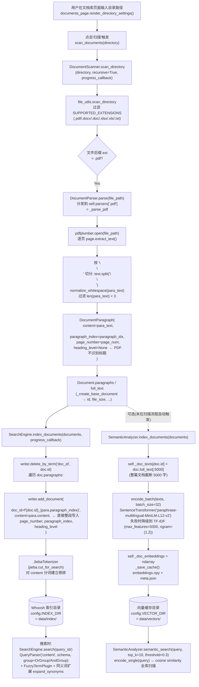

# RAG 数据流水线与检索质量分析

> 本文档基于 [document_parser.py](file:///Users/huwenjie/项目/gsb/label-00208/backend/app/services/document_parser.py)、[search_engine.py](file:///Users/huwenjie/项目/gsb/label-00208/backend/app/services/search_engine.py)、[document.py](file:///Users/huwenjie/项目/gsb/label-00208/backend/app/models/document.py)、[semantic_analyzer.py](file:///Users/huwenjie/项目/gsb/label-00208/backend/app/services/semantic_analyzer.py) 实际实现进行分析，所有结论均能在代码中找到对应位置。

---

## 一、PDF 上传 → 可被语义搜索的完整数据流水线

### 1. 关键事实（基于代码）

阅读现有代码可以确认：项目中**并不存在严格意义上的"PDF 上传"端点**——文档来源是用户在 [documents_page.py](file:///Users/huwenjie/项目/gsb/label-00208/backend/app/views/documents_page.py#L72-L118) 中输入一个目录路径，由 `DocumentScanner.scan_directory` 扫描该目录下的文件后逐个解析。所谓"上传 PDF"在本项目中等价于**把 PDF 放入指定目录并触发扫描**。

同时，"可被语义搜索"对应两条不同的索引链路（项目里二者并存）：

- **倒排索引（Whoosh + jieba）**：由 [SearchEngine.index_documents](file:///Users/huwenjie/项目/gsb/label-00208/backend/app/services/search_engine.py#L157-L220) 写入，支持基于词项的搜索（同义词扩展、布尔查询、模糊查询）。这是 [SearchEngine.search](file:///Users/huwenjie/项目/gsb/label-00208/backend/app/services/search_engine.py#L222-L305) 的实际数据源。
- **向量索引（Sentence-Transformers / TF-IDF 降级）**：由 [SemanticAnalyzer.index_documents](file:///Users/huwenjie/项目/gsb/label-00208/backend/app/services/semantic_analyzer.py#L448-L488) 写入到 `data/vectors/embeddings.npy`，由 [SemanticAnalyzer.semantic_search](file:///Users/huwenjie/项目/gsb/label-00208/backend/app/services/semantic_analyzer.py#L306-L333) 消费。但代码里 `semantic_search` 当前没有被任何视图直接调用，文档级嵌入主要用于"概念联想"等附加功能。

### 2. 数据流图（Mermaid flowchart）



### 3. 与"语义搜索"相关的具体函数与参数（速查表）

| 阶段 | 入口 | 关键函数 / 参数 |
|---|---|---|
| 解析 | [_parse_pdf](file:///Users/huwenjie/项目/gsb/label-00208/backend/app/services/document_parser.py#L301-L347) | `pdfplumber.open` → `page.extract_text()`；`text.split("\n\n")`；`normalize_whitespace(para_text)`；`len(para_text) < 3` 过滤 |
| 数据模型 | [DocumentParagraph](file:///Users/huwenjie/项目/gsb/label-00208/backend/app/models/document.py#L9-L19) | 字段：`content / paragraph_index / heading_level / page_number`；PDF 路径下 `heading_level` 始终为 `None` |
| 倒排建索引 | [SearchEngine.index_documents](file:///Users/huwenjie/项目/gsb/label-00208/backend/app/services/search_engine.py#L157-L220) | `writer.add_document(doc_id=f"{doc.id}_{para.paragraph_index}", content=para.content, ...)`；分析器 `JiebaTokenizer` 调用 `jieba.cut_for_search` |
| 倒排搜索 | [SearchEngine.search](file:///Users/huwenjie/项目/gsb/label-00208/backend/app/services/search_engine.py#L222-L305) | `QueryParser("content", schema, group=OrGroup/AndGroup)`、`FuzzyTermPlugin`、`expand_synonyms` 同义词、`HtmlFormatter("mark") + ContextFragmenter(maxchars=300, surround=50)` |
| 向量编码 | [SemanticAnalyzer.encode_batch](file:///Users/huwenjie/项目/gsb/label-00208/backend/app/services/semantic_analyzer.py#L181-L202) | `SentenceTransformer("paraphrase-multilingual-MiniLM-L12-v2")`，失败降级为 `TfidfVectorizer(max_features=5000, ngram_range=(1,2))` |
| 向量索引 | [SemanticAnalyzer._save_cache](file:///Users/huwenjie/项目/gsb/label-00208/backend/app/services/semantic_analyzer.py#L490-L506) | `embeddings.npy + meta.json`；每篇文档**只存一条向量**，文本被截断到 `doc.full_text[:5000]` |
| 向量检索 | [SemanticAnalyzer.semantic_search](file:///Users/huwenjie/项目/gsb/label-00208/backend/app/services/semantic_analyzer.py#L306-L333) | 在 `_doc_embeddings` 上线性扫描余弦相似度，默认 `threshold=0.3`、`top_k=10` |

---

## 二、当前文本分块策略的三个问题与改进方案

### 问题 1：块大小由 `\n\n` 决定，长段落会被整段送入索引/编码，可能切断或淹没语句

- **代码位置**：[document_parser.py#L320-L334](file:///Users/huwenjie/项目/gsb/label-00208/backend/app/services/document_parser.py#L320-L334) 的 `page_paragraphs = text.split("\n\n")` 与 [semantic_analyzer.py#L468](file:///Users/huwenjie/项目/gsb/label-00208/backend/app/services/semantic_analyzer.py#L468) 的 `text = doc.full_text[:5000]`。
- **问题表现**：
  - PDF 抽取出的"段落"长度极不均衡：有的只有标题一行，有的是跨多句的整段叙述。当一段超过模型最大序列（MiniLM 默认 128 tokens 后被截断）时，后半句信息会被丢弃；
  - 语义嵌入侧又把全文截断到 `[:5000]` 字符，超过 5000 字的 PDF 直接丢失末尾内容；
  - Whoosh 单条记录也是整个段落，命中后高亮 `ContextFragmenter(maxchars=300, surround=50)` 也只能在该段落内截取，跨段语义无法呈现。

- **改进方案（代码级）**：在 `_parse_pdf` 之后增加一个统一的 `chunk_paragraphs` 步骤，按"目标长度 + 句子边界"二次切分。复用已有的 [extract_sentences](file:///Users/huwenjie/项目/gsb/label-00208/backend/app/utils/text_utils.py#L31-L36)（已经能处理中英文标点）。

  ```python
  # 建议新增 utils/text_utils.py
  def chunk_text(text: str, target_chars: int = 400, max_chars: int = 600) -> list[str]:
      sentences = extract_sentences(text)
      chunks, buf, buf_len = [], [], 0
      for s in sentences:
          if buf_len + len(s) > max_chars and buf:
              chunks.append("。".join(buf) + "。")
              buf, buf_len = [], 0
          buf.append(s); buf_len += len(s)
          if buf_len >= target_chars:
              chunks.append("。".join(buf) + "。")
              buf, buf_len = [], 0
      if buf:
          chunks.append("。".join(buf) + "。")
      return chunks
  ```

  在 [_parse_pdf](file:///Users/huwenjie/项目/gsb/label-00208/backend/app/services/document_parser.py#L322-L334) 内将 `for para_text in page_paragraphs:` 改为：

  ```python
  for raw in page_paragraphs:
      raw = normalize_whitespace(raw)
      if not raw or len(raw) < 3:
          continue
      for sub in chunk_text(raw, target_chars=400, max_chars=600):
          paragraphs.append(DocumentParagraph(
              content=sub,
              paragraph_index=paragraph_idx,
              page_number=page_num,
          ))
          paragraph_idx += 1
  ```

  同时把 [semantic_analyzer.py 的 `doc.full_text[:5000]`](file:///Users/huwenjie/项目/gsb/label-00208/backend/app/services/semantic_analyzer.py#L468) 改为按段落级别向量化（见问题 3 改进方案，与之联动）。

### 问题 2：完全没有 overlap，跨块语义被切断

- **代码位置**：[document_parser.py#L320](file:///Users/huwenjie/项目/gsb/label-00208/backend/app/services/document_parser.py#L320) 仅 `split("\n\n")`，[search_engine.py#L188-L198](file:///Users/huwenjie/项目/gsb/label-00208/backend/app/services/search_engine.py#L188-L198) 把 paragraph 直接独立写入索引，相邻段落没有任何字符共享。
- **问题表现**：当一个论据跨越段落边界（例如"……据国家统计局数据，\n\n2023 年青年失业率为 21.3%"），用户搜索"青年失业率 国家统计局"将很可能命中分别在两段中、相似度均不高的两条记录，召回排序被压低。
- **改进方案（代码级）**：让分块带 `overlap_chars`（建议 80~120），改造上一段 `chunk_text`：

  ```python
  def chunk_text_with_overlap(text: str, target: int = 400, max_chars: int = 600,
                              overlap: int = 100) -> list[str]:
      base = chunk_text(text, target, max_chars)
      if overlap <= 0 or len(base) <= 1:
          return base
      out = [base[0]]
      for prev, cur in zip(base, base[1:]):
          tail = prev[-overlap:]
          out.append(tail + cur)
      return out
  ```

  在 [DocumentParagraph](file:///Users/huwenjie/项目/gsb/label-00208/backend/app/models/document.py#L9-L19) 上新增可选字段 `overlap_with_prev: bool = False`，便于检索结果合并时去重（避免同一句子被两条 chunk 同时命中导致重复）。在 [search_engine.search](file:///Users/huwenjie/项目/gsb/label-00208/backend/app/services/search_engine.py#L280-L299) 收集 `hit` 时按 `(doc_id, paragraph_index)` 邻近聚合即可。

### 问题 3：未考虑文档结构（标题/列表/表格），所有内容被一视同仁

- **代码位置**：
  - [_parse_docx](file:///Users/huwenjie/项目/gsb/label-00208/backend/app/services/document_parser.py#L160-L211) 已经识别 `heading_level`，但 [_parse_pdf](file:///Users/huwenjie/项目/gsb/label-00208/backend/app/services/document_parser.py#L301-L347) **完全没有传入 heading_level**；
  - Schema 里虽然有 [heading_level=NUMERIC(stored=True)](file:///Users/huwenjie/项目/gsb/label-00208/backend/app/services/search_engine.py#L88)，但 [search](file:///Users/huwenjie/项目/gsb/label-00208/backend/app/services/search_engine.py#L260-L270) 时只查 `content` 字段，没用作 boost；
  - Excel 行被简单 `" | ".join` 拼成一行（[document_parser.py#L291-L297](file:///Users/huwenjie/项目/gsb/label-00208/backend/app/services/document_parser.py#L291-L297)），表头与数据混在一起。
- **改进方案（代码级）**：

  1) **PDF 标题识别**（在 `_parse_pdf` 中基于字号/粗体推断）：

  ```python
  with pdfplumber.open(file_path) as pdf:
      for page_num, page in enumerate(pdf.pages, start=1):
          # 用 chars 统计字号，超过页面中位数 1.4 倍的视为标题候选
          chars = page.chars
          if chars:
              median = sorted(c["size"] for c in chars)[len(chars)//2]
              # 按行聚合 chars，对每行算平均 size 与是否粗体
              ...
              dp = DocumentParagraph(
                  content=line_text,
                  paragraph_index=paragraph_idx,
                  page_number=page_num,
                  heading_level=1 if avg_size > median * 1.4 else None,
              )
  ```

  2) **结构感知的字段加权**：把 [Schema](file:///Users/huwenjie/项目/gsb/label-00208/backend/app/services/search_engine.py#L80-L90) 中新增 `heading TEXT(field_boost=2.0, analyzer=create_jieba_analyzer())`，索引时把 `heading_level<=2` 的段落同时写入 `heading` 字段；在 [_parse_query](file:///Users/huwenjie/项目/gsb/label-00208/backend/app/services/search_engine.py#L307-L322) 用 `MultifieldParser(["content", "heading"], schema, ...)` 替换 `QueryParser("content", ...)`。

  3) **列表/表格**：在 `chunk_text` 之前先按 `^\s*([0-9]+[\.、)]|[一二三四五六七八九十]+[、.])` 等正则识别列表项，作为独立小 chunk，避免列表多项被合成超长块；Excel 在 [_parse_excel](file:///Users/huwenjie/项目/gsb/label-00208/backend/app/services/document_parser.py#L213-L299) 内把首行作为 `header`，后续每行 chunk 化为 "字段: 值" 形式，使表格内容也能被检索。

---

## 三、当前语义检索召回不足的原因及综合提升方案

### 1. 现状中召回偏低的根因

| 维度 | 现状（代码引用） | 召回风险 |
|---|---|---|
| 嵌入粒度 | 每篇文档**只编码一条向量**，且文本被 [`doc.full_text[:5000]` 截断](file:///Users/huwenjie/项目/gsb/label-00208/backend/app/services/semantic_analyzer.py#L468) | 长文档信息淹没；末尾被丢弃 |
| 模型 | [`paraphrase-multilingual-MiniLM-L12-v2`](file:///Users/huwenjie/项目/gsb/label-00208/backend/app/services/semantic_analyzer.py#L28)，CPU 通用句向量；中文专项语料少 | 中文查询和段落语义对齐差 |
| 阈值 | 硬编码 [`SIMILARITY_THRESHOLD=0.3`](file:///Users/huwenjie/项目/gsb/label-00208/backend/app/config.py#L25)，[`semantic_search` 默认 `threshold=0.3`](file:///Users/huwenjie/项目/gsb/label-00208/backend/app/services/semantic_analyzer.py#L310) | 静态阈值与查询长度/文档分布无关，长查询天然分数偏低 |
| 全局检索 | [`semantic_search` 用 `for i in range(...)` 线性扫描](file:///Users/huwenjie/项目/gsb/label-00208/backend/app/services/semantic_analyzer.py#L325-L332)，未用近邻索引 | 数据量大时只能强行降低 top_k |
| 主搜索路径 | [search_engine.search 完全基于 Whoosh + jieba](file:///Users/huwenjie/项目/gsb/label-00208/backend/app/services/search_engine.py#L222-L305)，未与向量结果融合 | 词面不匹配的语义近义查询直接 0 召回 |
| 查询扩展 | 仅有手工同义词（[expand_synonyms](file:///Users/huwenjie/项目/gsb/label-00208/backend/app/services/search_engine.py#L247-L250)），无 LLM/上下文级查询重写 | 长尾问句、口语化提问无法匹配 |
| 降级行为 | [TF-IDF 单条 fit](file:///Users/huwenjie/项目/gsb/label-00208/backend/app/services/semantic_analyzer.py#L160-L179)：每次新查询会重新 `fit_transform(all_texts + [query])`，不仅慢且向量空间漂移 | 相似度计算不稳定 |
| 重排 | 无；[search 直接用 Whoosh BM25 score](file:///Users/huwenjie/项目/gsb/label-00208/backend/app/services/search_engine.py#L297) 排序 | 顶部结果与查询语义关联弱时无救济 |

### 2. 综合提升方案（含集成位置与实现思路）

#### 方案 A：混合检索（BM25 + 向量），RRF 融合

- **目标**：保留 Whoosh 已有词项命中能力，补充向量召回近义内容。
- **集成位置**：在 [SearchEngine.search](file:///Users/huwenjie/项目/gsb/label-00208/backend/app/services/search_engine.py#L222-L305) 内并联调用 `SemanticAnalyzer.semantic_search`。
- **实现思路**：

  1) 把 `SemanticAnalyzer.index_documents` 改为**段落级**索引（与第二节问题 3 联动）：

  ```python
  # semantic_analyzer.py
  def index_documents(self, documents):
      self._chunk_ids, chunk_texts = [], []
      for doc in documents:
          for p in doc.paragraphs:
              cid = f"{doc.id}_{p.paragraph_index}"
              self._chunk_ids.append(cid)
              self._doc_texts[cid] = p.content
              chunk_texts.append(p.content)
      self._doc_embeddings = self.encode_batch(chunk_texts, batch_size=32)
      self._save_cache()
  ```

  这样 chunk 维度与 Whoosh 的 `doc_id=f"{doc.id}_{para.paragraph_index}"` 完全对齐，便于融合。

  2) 在 `SearchEngine.search` 末尾增加：

  ```python
  # search_engine.py
  def hybrid_search(self, query_str, max_results=20, alpha=0.5):
      bm25 = self.search(query_str, max_results=max_results * 3)
      from app.services.semantic_analyzer import SemanticAnalyzer
      vec = SemanticAnalyzer().semantic_search(query_str, top_k=max_results * 3, threshold=0.0)
      # RRF (Reciprocal Rank Fusion)
      k = 60
      scores = {}
      for rank, item in enumerate(bm25.items):
          scores[item.doc_id] = scores.get(item.doc_id, 0) + 1 / (k + rank)
      for rank, (doc_id, sim, _) in enumerate(vec):
          scores[doc_id] = scores.get(doc_id, 0) + 1 / (k + rank)
      ...  # 按 scores 重新组装 SearchResult
  ```

- **优势**：词面/语义双覆盖，无需调阈值；RRF 不依赖分数尺度可比性。

#### 方案 B：查询重写（同义扩展 + 子查询拆分）

- **目标**：弥补"年轻人就业焦虑"这类口语化提问与文档"青年失业率""高校毕业生就业压力"之间的词面差。
- **集成位置**：[SearchEngine.search](file:///Users/huwenjie/项目/gsb/label-00208/backend/app/services/search_engine.py#L244-L257) 现有 `expand_synonyms` 分支。
- **实现思路**：

  1) **结构化重写**：`expand_synonyms` 现在只做 OR 拼接，建议改为生成"原查询 + N 条改写"列表，分别走一次检索后再 RRF：

  ```python
  # search_engine.py
  def _rewrite_queries(self, query_str: str) -> list[str]:
      from app.utils.synonym_dict import get_synonym_dict
      sd = get_synonym_dict()
      base = [query_str]
      # 1) 同义替换：对查询里命中词典的每个词替换一次
      for term, syns in sd.iter_query_terms(query_str):
          for s in syns[:2]:
              base.append(query_str.replace(term, s))
      # 2) jieba 关键词抽取：去掉口语虚词
      import jieba.analyse
      kws = jieba.analyse.extract_tags(query_str, topK=5)
      if kws:
          base.append(" ".join(kws))
      return list(dict.fromkeys(base))  # 去重保序
  ```

  2) **可选 LLM 重写**（若日后接入）：在配置中新增 `QUERY_REWRITE_MODEL`，未配置时回退到上面规则版，保证当前部署形态可用。

  3) **概念库联动**：复用 [SemanticAnalyzer.find_similar_concepts](file:///Users/huwenjie/项目/gsb/label-00208/backend/app/services/semantic_analyzer.py#L224-L276)，把 `top_k=3` 的相关概念追加为额外子查询，使"年轻人"→自动补出"青年/Z 世代"等检索分支。

#### 方案 C：重排序（Cross-Encoder Re-ranker）

- **目标**：当混合召回 top-N (N=30~50) 中真正相关的内容排在第 20+ 时，用更强的交互式模型把它推到前 5。
- **集成位置**：在新加的 `hybrid_search` 末尾，对融合后的 top-N 调用一次 reranker，再截到 `max_results`。
- **实现思路**：
  - 模型选用 `BAAI/bge-reranker-base`（多语言、CPU 可跑），与现有 `sentence-transformers` 同生态；
  - 复用 `get_sentence_model` 的延迟加载范式（参见 [semantic_analyzer.py#L38-L68](file:///Users/huwenjie/项目/gsb/label-00208/backend/app/services/semantic_analyzer.py#L38-L68)），新增一个 `_reranker` 全局缓存，加载失败时自动跳过 rerank 阶段（保持当前行为不退化）。

  ```python
  # semantic_analyzer.py 顶部
  _reranker = None
  def get_reranker():
      global _reranker
      if _reranker is None:
          try:
              from sentence_transformers import CrossEncoder
              _reranker = CrossEncoder("BAAI/bge-reranker-base")
          except Exception as e:
              logger.warning(f"reranker 不可用，跳过精排: {e}")
              _reranker = False
      return _reranker if _reranker else None

  def rerank(query: str, candidates: list[tuple[str, str]]) -> list[tuple[str, float]]:
      """candidates: [(doc_id, text), ...] -> [(doc_id, score), ...]"""
      ce = get_reranker()
      if ce is None or not candidates:
          return [(c[0], 0.0) for c in candidates]
      scores = ce.predict([(query, t) for _, t in candidates])
      return sorted(zip([c[0] for c in candidates], scores.tolist()),
                    key=lambda x: x[1], reverse=True)
  ```

  在 `hybrid_search` 内：

  ```python
  fused_top = sorted(scores.items(), key=lambda x: x[1], reverse=True)[:50]
  doc_text = {item.doc_id: item.content for item in bm25.items}
  for cid in [c[0] for c in fused_top]:
      doc_text.setdefault(cid, SemanticAnalyzer()._doc_texts.get(cid, ""))
  reranked = rerank(query_str, [(cid, doc_text[cid]) for cid in [c[0] for c in fused_top]])
  final = reranked[:max_results]
  ```

### 3. 集成路径汇总

| 方案 | 入口文件 | 关键改动点 |
|---|---|---|
| A. 混合检索 RRF | [search_engine.py](file:///Users/huwenjie/项目/gsb/label-00208/backend/app/services/search_engine.py) + [semantic_analyzer.py](file:///Users/huwenjie/项目/gsb/label-00208/backend/app/services/semantic_analyzer.py) | 新增 `SearchEngine.hybrid_search`；`SemanticAnalyzer.index_documents` 改为段落级索引 |
| B. 查询重写 | [search_engine.py](file:///Users/huwenjie/项目/gsb/label-00208/backend/app/services/search_engine.py) `_parse_query/search` | 新增 `_rewrite_queries`，多查询并联 + RRF；与 [synonym_dict.py](file:///Users/huwenjie/项目/gsb/label-00208/backend/app/utils/synonym_dict.py) 解耦 |
| C. Cross-Encoder 重排 | [semantic_analyzer.py](file:///Users/huwenjie/项目/gsb/label-00208/backend/app/services/semantic_analyzer.py) 新增 `rerank`；在 `hybrid_search` 末尾调用 | 复用现有延迟加载/降级范式 |
| 阈值动态化 | [config.py](file:///Users/huwenjie/项目/gsb/label-00208/backend/app/config.py) | 把 `SIMILARITY_THRESHOLD` 改为按召回数自适应：先取 top_k，再过滤 `score < max_score * 0.6` |
| 模型升级（可选） | [semantic_analyzer.py#L28](file:///Users/huwenjie/项目/gsb/label-00208/backend/app/services/semantic_analyzer.py#L28) | 中文专项可换 `BAAI/bge-small-zh-v1.5` 或 `shibing624/text2vec-base-chinese`；保持 `paraphrase-multilingual-MiniLM-L12-v2` 作为多语言 fallback |

按上述顺序（A → B → C）渐进改造，能在不破坏现有 Whoosh 主路径的前提下系统性地提升 recall：A 解决"语义近似但词面不同"，B 解决"提法差异"，C 解决"召回到了但排不上来"。
