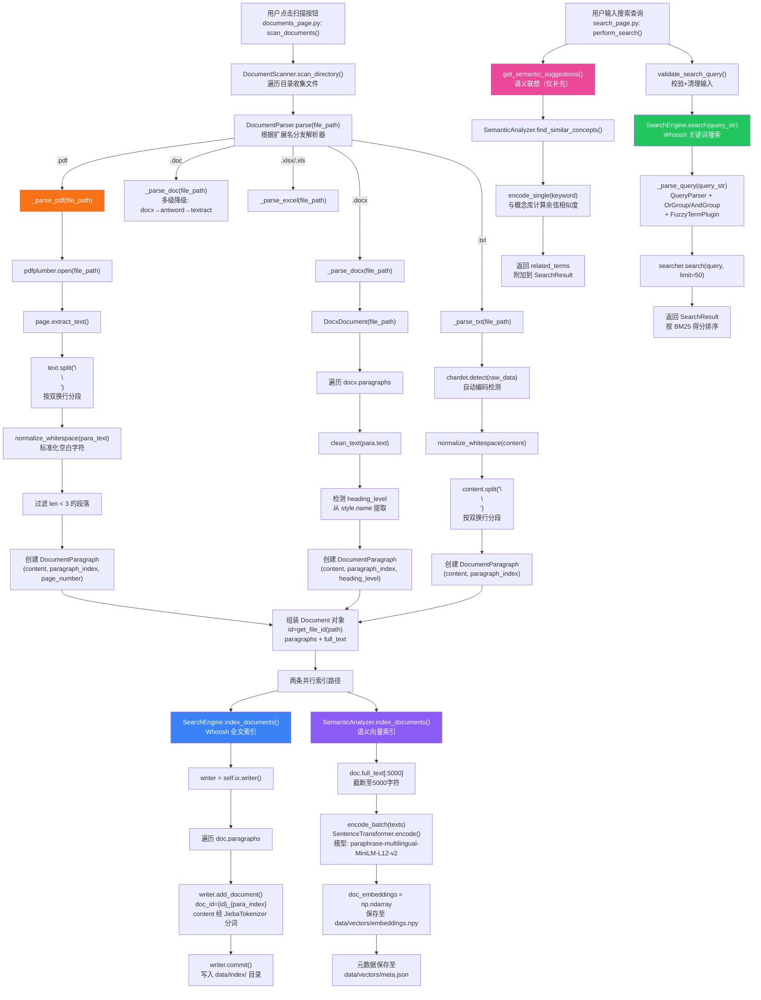

# 辩论赛智能备赛助手 RAG 数据流水线分析

---

## 一、数据处理流水线（PDF 上传 → 语义搜索）

### 1.1 完整数据流图



### 1.2 流水线关键函数与参数汇总

| 阶段 | 函数 | 关键参数 | 所在文件 |
|------|------|----------|----------|
| 文件解析入口 | `DocumentParser.parse(file_path)` | `file_path: str` | `document_parser.py:44` |
| PDF 解析 | `_parse_pdf(file_path)` | `pdfplumber.open()`, `page.extract_text()`, `split("\n\n")`, `len < 3` 过滤 | `document_parser.py:301` |
| DOCX 解析 | `_parse_docx(file_path)` | `DocxDocument()`, `clean_text()`, heading 检测 | `document_parser.py:160` |
| TXT 解析 | `_parse_txt(file_path)` | `chardet.detect()`, `normalize_whitespace()`, `split("\n\n")` | `document_parser.py:349` |
| 文本清理 | `clean_text(text)` | `re.sub(r"\s+", " ", text)` | `text_utils.py:9` |
| 空白标准化 | `normalize_whitespace(text)` | `re.sub(r"[ \t]+", " ", line)` | `text_utils.py:20` |
| 文档 ID 生成 | `get_file_id(file_path)` | `hashlib.md5(path.encode()).hexdigest()[:16]` | `file_utils.py:18` |
| Whoosh 索引 | `SearchEngine.index_documents(documents)` | Schema: `doc_id(ID)`, `content(TEXT, JiebaTokenizer)`, `paragraph_index(NUMERIC)` | `search_engine.py:157` |
| 中文分词 | `JiebaTokenizer.__call__()` | `jieba.cut_for_search(value)` | `search_engine.py:29` |
| 语义嵌入 | `SemanticAnalyzer.index_documents(documents)` | `full_text[:5000]`, `batch_size=32` | `semantic_analyzer.py:448` |
| 嵌入模型 | `SentenceTransformer(_model_name)` | `"paraphrase-multilingual-MiniLM-L12-v2"` | `semantic_analyzer.py:28` |
| TF-IDF 降级 | `get_tfidf_vectorizer()` | `max_features=5000`, `ngram_range=(1,2)`, `jieba.cut` tokenizer | `semantic_analyzer.py:71` |
| 向量存储 | `_save_cache()` | `data/vectors/embeddings.npy`, `data/vectors/meta.json` | `semantic_analyzer.py:490` |
| 关键词搜索 | `SearchEngine.search(query_str)` | `max_results=50`, `OrGroup` 默认, `FuzzyTermPlugin` | `search_engine.py:222` |
| 语义联想 | `get_semantic_suggestions(keyword, documents)` | `top_k=12`, `SIMILARITY_THRESHOLD=0.3` | `semantic_analyzer.py:539` |

### 1.3 关键发现：语义搜索未集成到主搜索流程

当前代码存在一个重要架构问题：**语义向量搜索与关键词搜索是割裂的**。

- `SearchEngine.search()` 基于 Whoosh 执行纯关键词 BM25 搜索，是主搜索路径
- `SemanticAnalyzer.semantic_search()` 虽然实现了向量余弦相似度搜索，但**从未在搜索页面被调用**
- 语义分析器仅用于 `get_semantic_suggestions()` 生成联想词，作为搜索结果的补充展示
- 用户搜索时实际走的是：`perform_search()` → `SearchEngine.search()` → Whoosh BM25，语义向量完全不参与检索

---

## 二、文本分块策略问题分析与改进方案

### 2.1 问题一：段落分割方式可能切断语句

**现状分析**

PDF 解析使用 `text.split("\n\n")` 进行分段（[document_parser.py:320](file:///Users/huwenjie/项目/gsb/label-00208/backend/app/services/document_parser.py#L320)），TXT 同理（[document_parser.py:371](file:///Users/huwenjie/项目/gsb/label-00208/backend/app/services/document_parser.py#L371)）。这种方式存在以下问题：

1. **PDF 提取文本的换行不可靠**：`pdfplumber` 提取的文本中，换行符可能来自排版换行（一行排满自动换行）而非语义段落分隔，导致一个完整句子被拆成多个"段落"
2. **双换行不一定对应段落边界**：某些 PDF 的段落间只有一个换行，列表项之间可能有多个换行，导致分块粒度不一致
3. **短段落被过滤**：`len(para_text) < 3` 的过滤条件（[document_parser.py:324](file:///Users/huwenjie/项目/gsb/label-00208/backend/app/services/document_parser.py#L324)）可能丢弃有意义的短句（如"是。""否。"）

**改进方案：基于句子边界和最小长度的智能合并**

在 `_parse_pdf` 方法中，替换简单的 `split("\n\n")` 为基于句子边界的合并策略：

```python
import re

def _smart_split_paragraphs(self, text: str, min_chunk_len: int = 50, max_chunk_len: int = 1000) -> list[str]:
    """基于句子边界的智能分段"""
    sentence_endings = re.compile(r'([。！？\.!?]+[」』"\'\s]*)')
    sentences = sentence_endings.split(text)

    merged_sentences = []
    current = ""
    for i in range(0, len(sentences) - 1, 2):
        s = sentences[i] + (sentences[i + 1] if i + 1 < len(sentences) else "")
        s = s.strip()
        if not s:
            continue
        if len(current) + len(s) < min_chunk_len:
            current += s
        else:
            if current:
                merged_sentences.append(current)
            current = s
    if current:
        merged_sentences.append(current)

    chunks = []
    current_chunk = ""
    for s in merged_sentences:
        if len(current_chunk) + len(s) > max_chunk_len and current_chunk:
            chunks.append(current_chunk.strip())
            current_chunk = s
        else:
            current_chunk += s
    if current_chunk:
        chunks.append(current_chunk.strip())

    return [c for c in chunks if len(c) >= 10]
```

集成位置：替换 `_parse_pdf` 中的 `text.split("\n\n")`（第 320 行）和 `_parse_txt` 中的 `content.split("\n\n")`（第 371 行）。

### 2.2 问题二：没有 overlap 导致上下文丢失

**现状分析**

当前所有文档类型的分段都是硬切割，相邻段落之间没有任何重叠内容。这导致：

1. **跨段落的语义断裂**：如果一个论点跨越两个段落，搜索时可能只命中其中一个，丢失完整上下文
2. **边界信息丢失**：段落末尾和下一段落开头往往有紧密的语义关联（如"因此"/"综上所述"），硬切割后这种关联被切断
3. **检索结果缺乏上下文**：用户搜索命中某个段落时，无法看到前后文，难以判断该段落是否真正相关

**改进方案：滑动窗口 + overlap 策略**

```python
def _split_with_overlap(self, paragraphs: list[str], overlap_sentences: int = 2) -> list[str]:
    """带重叠的段落分割"""
    if not paragraphs:
        return []

    sentence_endings = re.compile(r'(?<=[。！？!?])\s*')
    all_sentences = []
    for para in paragraphs:
        sents = [s.strip() for s in sentence_endings.split(para) if s.strip()]
        all_sentences.extend(sents)

    if not all_sentences:
        return paragraphs

    chunks = []
    i = 0
    while i < len(all_sentences):
        chunk_end = min(i + 8, len(all_sentences))
        chunk_text = "".join(all_sentences[i:chunk_end])
        chunks.append(chunk_text)
        i += max(1, chunk_end - i - overlap_sentences)

    return chunks
```

同时需要在 `DocumentParagraph` 模型中增加 `overlap_with_prev: bool` 和 `source_paragraph_range: tuple[int, int]` 字段，以便在搜索结果中标识重叠段落并去重：

```python
@dataclass
class DocumentParagraph:
    content: str
    paragraph_index: int
    heading_level: Optional[int] = None
    page_number: Optional[int] = None
    overlap_with_prev: bool = False
    source_paragraph_range: Optional[tuple[int, int]] = None
```

集成位置：在 `_parse_pdf` 中，对 `page_paragraphs` 列表调用 `_split_with_overlap` 后再创建 `DocumentParagraph` 对象。

### 2.3 问题三：未考虑文档结构（标题/段落/列表）

**现状分析**

1. **PDF 不提取标题层级**：`_parse_pdf` 创建的 `DocumentParagraph` 没有设置 `heading_level`（[document_parser.py:327-331](file:///Users/huwenjie/项目/gsb/label-00208/backend/app/services/document_parser.py#L327)），所有段落都是平级的
2. **列表项被当作独立段落**：PDF 中的编号列表（如"1. xxx" "2. xxx"）被拆成独立段落，失去列表的整体语义
3. **标题与正文关联丢失**：虽然 DOCX 解析保留了 `heading_level`（[document_parser.py:179-190](file:///Users/huwenjie/项目/gsb/label-00208/backend/app/services/document_parser.py#L179)），但标题和其下属正文段落之间没有建立层级关系，搜索时无法利用标题作为上下文增强

**改进方案：结构感知的分块策略**

```python
import re

def _parse_pdf_structured(self, file_path: str) -> Optional[Document]:
    """结构感知的 PDF 解析"""
    doc = self._create_base_document(file_path, "pdf")
    paragraphs = []
    full_text_parts = []
    paragraph_idx = 0

    with pdfplumber.open(file_path) as pdf:
        doc.page_count = len(pdf.pages)
        current_heading = None
        current_heading_level = 0

        for page_num, page in enumerate(pdf.pages, start=1):
            text = page.extract_text()
            if not text:
                continue

            lines = text.split("\n")
            for line in lines:
                line = line.strip()
                if not line:
                    continue

                heading_level = self._detect_heading(line)
                if heading_level is not None:
                    current_heading = line
                    current_heading_level = heading_level
                    dp = DocumentParagraph(
                        content=line,
                        paragraph_index=paragraph_idx,
                        heading_level=heading_level,
                        page_number=page_num,
                    )
                    paragraphs.append(dp)
                    full_text_parts.append(line)
                    paragraph_idx += 1
                else:
                    if current_heading and len(line) < 20:
                        continue
                    dp = DocumentParagraph(
                        content=line,
                        paragraph_index=paragraph_idx,
                        heading_level=None,
                        page_number=page_num,
                    )
                    paragraphs.append(dp)
                    full_text_parts.append(line)
                    paragraph_idx += 1

    doc.paragraphs = paragraphs
    doc.full_text = "\n\n".join(full_text_parts)
    return doc


def _detect_heading(self, line: str) -> Optional[int]:
    """检测行是否为标题，返回标题级别"""
    patterns = [
        (r'^第[一二三四五六七八九十百]+[章节篇部]', 1),
        (r'^[一二三四五六七八九十]+[、.]', 2),
        (r'^\d+[\.、]\s*\S', 2),
        (r'^\d+\.\d+\s*\S', 3),
        (r'^[（(]\s*[一二三四五六七八九十]+\s*[）)]', 3),
        (r'^[（(]\s*\d+\s*[）)]', 3),
    ]
    for pattern, level in patterns:
        if re.match(pattern, line):
            return level

    if len(line) <= 30 and not line.endswith(('。', '，', '！', '？', '.', ',')):
        if re.search(r'[\u4e00-\u9fff]{2,}', line):
            return 2

    return None
```

进一步，在索引时将标题作为上下文前缀注入正文段落，增强检索时的语义完整性：

```python
def _enrich_with_heading_context(self, paragraphs: list[DocumentParagraph]) -> list[DocumentParagraph]:
    """将标题信息注入子段落，增强语义上下文"""
    heading_stack = {}
    for para in paragraphs:
        if para.is_heading:
            heading_stack[para.heading_level] = para.content
        else:
            context_parts = []
            for level in sorted(heading_stack.keys()):
                context_parts.append(heading_stack[level])
            if context_parts:
                para.content = " > ".join(context_parts) + "\n" + para.content
    return paragraphs
```

集成位置：替换 `_parse_pdf` 方法（[document_parser.py:301](file:///Users/huwenjie/项目/gsb/label-00208/backend/app/services/document_parser.py#L301)），并在 `index_document` 调用前对 paragraphs 执行 `_enrich_with_heading_context`。

---

## 三、语义检索 Recall 不足的原因与提升方案

### 3.1 当前 Recall 不足的原因分析

#### 原因一：主搜索路径完全依赖关键词匹配，语义搜索未参与检索

当前搜索流程（[search_page.py: perform_search()](file:///Users/huwenjie/项目/gsb/label-00208/backend/app/views/search_page.py)）只调用 `SearchEngine.search()`，该方法基于 Whoosh 的 BM25 关键词匹配。`SemanticAnalyzer.semantic_search()` 虽然存在但从未被搜索页面调用。

这意味着：
- 用户搜索"年轻人压力"，如果文档中只出现"青年心理负担"，BM25 无法召回
- 同义词扩展（`SynonymDict`）是硬编码的有限词典，覆盖面极窄
- 语义联想词（`related_terms`）仅作为 UI 展示，不参与实际检索

#### 原因二：Embedding 模型选择与粒度问题

- **模型**：使用 `paraphrase-multilingual-MiniLM-L12-v2`（[semantic_analyzer.py:28](file:///Users/huwenjie/项目/gsb/label-00208/backend/app/services/semantic_analyzer.py#L28)），这是一个 384 维的小模型，对中文辩论场景的细粒度语义区分能力有限
- **粒度**：语义嵌入在文档级别生成（`doc.full_text[:5000]`，[semantic_analyzer.py:468](file:///Users/huwenjie/项目/gsb/label-00208/backend/app/services/semantic_analyzer.py#L468)），而非段落级别。长文档被截断到 5000 字符后整体编码，导致段落级别的语义信息被稀释
- **降级方案缺陷**：TF-IDF 降级模式使用 `jieba.cut` 作为 tokenizer（[semantic_analyzer.py:76](file:///Users/huwenjie/项目/gsb/label-00208/backend/app/services/semantic_analyzer.py#L76)），无法捕捉语义相似性

#### 原因三：相似度阈值策略单一

- 固定阈值 `SIMILARITY_THRESHOLD = 0.3`（[config.py](file:///Users/huwenjie/项目/gsb/label-00208/backend/app/config.py)），不区分查询类型（短查询 vs 长查询）和文档类型
- 没有基于 top-k 的动态阈值调整，可能导致短查询召回过多噪声或长查询召回不足

#### 原因四：查询扩展缺失

- 同义词扩展默认关闭（`expand_synonyms=False`，[search_engine.py:227](file:///Users/huwenjie/项目/gsb/label-00208/backend/app/services/search_engine.py#L227)），且搜索页面未启用
- 没有查询重写（Query Rewriting）机制，用户输入的口语化查询无法被转化为有效的检索词
- 没有伪相关反馈（Pseudo-Relevance Feedback）机制

### 3.2 提升方案

#### 方案一：混合检索 BM25 + 向量检索

**集成位置**：`SearchEngine.search()` 方法（[search_engine.py:222](file:///Users/huwenjie/项目/gsb/label-00208/backend/app/services/search_engine.py#L222)）

**实现思路**：

1. 并行执行 BM25 关键词搜索和向量语义搜索
2. 使用 Reciprocal Rank Fusion (RRF) 融合两路结果
3. 向量搜索需要从文档级改为段落级

```python
class SearchEngine:
    def __init__(self, index_dir: str = None):
        # ... 现有初始化代码 ...
        self._semantic_analyzer = None

    @property
    def semantic_analyzer(self):
        if self._semantic_analyzer is None:
            from app.services.semantic_analyzer import SemanticAnalyzer
            self._semantic_analyzer = SemanticAnalyzer()
        return self._semantic_analyzer

    def search(
        self,
        query_str: str,
        max_results: int = None,
        file_types: list[str] = None,
        expand_synonyms: bool = True,
        use_hybrid: bool = True,
        bm25_weight: float = 0.5,
        vector_weight: float = 0.5,
    ) -> SearchResult:
        if max_results is None:
            max_results = MAX_RESULTS

        bm25_results = self._bm25_search(query_str, max_results * 3, file_types)

        if use_hybrid and not self.semantic_analyzer.is_using_fallback_mode():
            vector_results = self._vector_search(query_str, max_results * 3)
            merged = self._reciprocal_rank_fusion(
                bm25_results, vector_results,
                bm25_weight, vector_weight
            )
        else:
            merged = bm25_results

        results = SearchResult(query=query_str)
        results.items = merged[:max_results]
        results.total_count = len(merged)
        return results

    def _bm25_search(self, query_str: str, limit: int, file_types: list[str] = None) -> list[SearchResultItem]:
        """现有 Whoosh 搜索逻辑，返回 list[SearchResultItem]"""
        # ... 现有 search() 方法中的 Whoosh 搜索逻辑 ...

    def _vector_search(self, query_str: str, limit: int) -> list[SearchResultItem]:
        """向量语义搜索"""
        query_embedding = self.semantic_analyzer.encode_single(query_str)
        if len(query_embedding) == 0:
            return []

        results = []
        for i, doc_id in enumerate(self.semantic_analyzer._doc_ids):
            sim = self.semantic_analyzer.similarity(query_embedding, self.semantic_analyzer._doc_embeddings[i])
            if sim >= SIMILARITY_THRESHOLD:
                results.append((doc_id, sim))

        results.sort(key=lambda x: x[1], reverse=True)
        return results[:limit]

    def _reciprocal_rank_fusion(
        self,
        bm25_results: list[SearchResultItem],
        vector_results: list[tuple],
        bm25_weight: float,
        vector_weight: float,
        k: int = 60,
    ) -> list[SearchResultItem]:
        """RRF 融合"""
        scores = {}

        for rank, item in enumerate(bm25_results):
            scores[item.doc_id] = scores.get(item.doc_id, 0) + bm25_weight / (k + rank + 1)

        for rank, (doc_id, sim) in enumerate(vector_results):
            scores[doc_id] = scores.get(doc_id, 0) + vector_weight / (k + rank + 1)

        sorted_ids = sorted(scores.items(), key=lambda x: x[1], reverse=True)

        id_to_item = {item.doc_id: item for item in bm25_results}
        merged = []
        for doc_id, score in sorted_ids:
            item = id_to_item.get(doc_id)
            if item:
                item.score = score
                merged.append(item)

        return merged
```

**关键改造点**：
- `SemanticAnalyzer.index_documents()` 需要从文档级嵌入改为段落级嵌入，每个 `DocumentParagraph` 单独编码
- 向量索引需要存储 `paragraph_index` 以便与 BM25 结果对齐

#### 方案二：查询重写（Query Rewriting）

**集成位置**：`SearchEngine.search()` 方法中，在 `_parse_query()` 调用之前（[search_engine.py:262](file:///Users/huwenjie/项目/gsb/label-00208/backend/app/services/search_engine.py#L262)）

**实现思路**：

1. 使用 LLM 或规则将用户口语化查询重写为结构化检索词
2. 提取查询中的核心实体和意图
3. 生成多个查询变体并行检索

```python
class QueryRewriter:
    def __init__(self):
        self._debate_patterns = {
            "好处": ["优势", "利", "益处", "积极影响", "正面作用"],
            "坏处": ["劣势", "弊", "风险", "消极影响", "负面作用"],
            "原因": ["因素", "根源", "成因", "背景", "动因"],
            "影响": ["作用", "效果", "后果", "冲击", "效应"],
            "应该": ["必要性", "合理性", "正当性"],
            "不应该": ["问题", "风险", "不合理性"],
        }

    def rewrite(self, query: str) -> list[str]:
        """生成查询变体"""
        variants = [query]

        for key, expansions in self._debate_patterns.items():
            if key in query:
                for exp in expansions:
                    variant = query.replace(key, exp)
                    variants.append(variant)

        core_entities = self._extract_entities(query)
        if core_entities:
            variants.append(" ".join(core_entities))

        return list(dict.fromkeys(variants))[:5]

    def _extract_entities(self, query: str) -> list[str]:
        """提取查询中的核心实体"""
        import jieba.posseg as pseg
        entities = []
        for word, flag in pseg.cut(query):
            if flag in ('n', 'nr', 'ns', 'nt', 'nz', 'v', 'vn'):
                if len(word) >= 2:
                    entities.append(word)
        return entities
```

在 `SearchEngine.search()` 中集成：

```python
def search(self, query_str: str, ...):
    rewriter = QueryRewriter()
    query_variants = rewriter.rewrite(query_str)

    all_results = []
    for variant in query_variants:
        results = self._bm25_search(variant, max_results)
        all_results.extend(results)

    # 去重并合并分数
    merged = self._merge_variant_results(all_results)
    ...
```

#### 方案三：重排序（Reranking）

**集成位置**：`SearchEngine.search()` 方法中，在获取搜索结果之后、返回之前（[search_engine.py:280-299](file:///Users/huwenjie/项目/gsb/label-00208/backend/app/services/search_engine.py#L280)）

**实现思路**：

1. 第一阶段：BM25/混合检索召回 top-K 候选（K 较大，如 100）
2. 第二阶段：使用交叉编码器（Cross-Encoder）对 (query, passage) 对精排
3. 无 Cross-Encoder 时，使用语义相似度重排作为降级方案

```python
class ResultReranker:
    def __init__(self):
        self._cross_encoder = None
        self._use_cross_encoder = False
        self._init_cross_encoder()

    def _init_cross_encoder(self):
        try:
            from sentence_transformers import CrossEncoder
            self._cross_encoder = CrossEncoder("cross-encoder/ms-marco-MiniLM-L-6-v2")
            self._use_cross_encoder = True
        except Exception:
            self._use_cross_encoder = False

    def rerank(
        self,
        query: str,
        items: list[SearchResultItem],
        top_k: int = 20,
    ) -> list[SearchResultItem]:
        if not items:
            return items

        if self._use_cross_encoder:
            return self._cross_encoder_rerank(query, items, top_k)
        else:
            return self._semantic_rerank(query, items, top_k)

    def _cross_encoder_rerank(
        self,
        query: str,
        items: list[SearchResultItem],
        top_k: int,
    ) -> list[SearchResultItem]:
        pairs = [(query, item.content) for item in items]
        scores = self._cross_encoder.predict(pairs)

        for item, score in zip(items, scores):
            item.score = float(score)

        items.sort(key=lambda x: x.score, reverse=True)
        return items[:top_k]

    def _semantic_rerank(
        self,
        query: str,
        items: list[SearchResultItem],
        top_k: int,
    ) -> list[SearchResultItem]:
        from app.services.semantic_analyzer import SemanticAnalyzer
        analyzer = SemanticAnalyzer()

        query_emb = analyzer.encode_single(query)
        for item in items:
            passage_emb = analyzer.encode_single(item.content)
            item.score = analyzer.similarity(query_emb, passage_emb)

        items.sort(key=lambda x: x.score, reverse=True)
        return items[:top_k]
```

在 `SearchEngine.search()` 中集成：

```python
def search(self, query_str: str, ...):
    # ... 现有检索逻辑，但 limit 调大为 max_results * 3 ...
    search_results = searcher.search(query, limit=max_results * 3)

    # ... 构建 items 列表 ...

    # 重排序
    reranker = ResultReranker()
    items = reranker.rerank(query_str, items, top_k=max_results)

    results.items = items
    results.total_count = len(items)
    return results
```

### 3.3 方案集成总览

| 方案 | 集成文件 | 集成位置 | 改造范围 |
|------|----------|----------|----------|
| 混合检索 BM25+向量 | `search_engine.py` | `SearchEngine.search()` 方法 | 新增 `_vector_search()`, `_reciprocal_rank_fusion()`；改造 `SemanticAnalyzer` 为段落级嵌入 |
| 查询重写 | `search_engine.py` | `search()` 方法中 `_parse_query()` 之前 | 新增 `QueryRewriter` 类，在 `search()` 中调用生成查询变体 |
| 重排序 | `search_engine.py` | `search()` 方法中返回结果之前 | 新增 `ResultReranker` 类，检索阶段扩大召回量，精排阶段截断至 `max_results` |

三个方案可渐进式集成：先实现混合检索（收益最大），再增加查询重写（提升召回覆盖），最后加入重排序（提升精度）。三者组合后，搜索流程变为：

```
用户查询 → 查询重写(多变体) → 并行检索(BM25 + 向量) → RRF融合 → 重排序 → 返回Top-K
```
