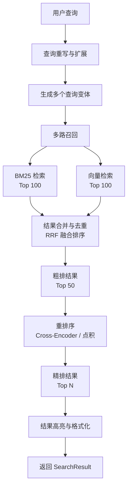

# 辩论赛智能备赛助手 RAG 系统分析报告

## 一、数据处理流水线分析

### 1.1 整体流程概述

从用户上传 PDF 文件到内容可被搜索，系统经历 **文件解析 → 文本分块 → 双重索引构建（关键词 + 语义）→ 存储** 四个主要阶段。系统采用双引擎架构：
- **关键词搜索**：基于 Whoosh + Jieba 分词，提供精确匹配
- **语义搜索**：基于 Sentence-Transformers（多语言 MiniLM），提供语义相似度匹配（文档级）

### 1.2 数据流向图（Mermaid）

```mermaid
flowchart TD
    A[用户上传 PDF 文件] --> B[DocumentParser.parse]
    B --> C{文件类型判断}
    C -->|.pdf| D[_parse_pdf<br/>参数: file_path]
    C -->|.docx| E[_parse_docx]
    C -->|其他| F[对应解析器]
    
    D --> G[pdfplumber.open<br/>逐页提取文本]
    G --> H[按 \\n\\n 分割段落]
    H --> I[normalize_whitespace<br/>清理空白]
    I --> J[过滤长度 < 3 的段落]
    J --> K[创建 DocumentParagraph 列表<br/>字段: content, paragraph_index, page_number]
    
    K --> L[Document 对象<br/>包含: paragraphs, full_text, 元数据]
    
    L --> M[SearchEngine.index_document]
    L --> N[SemanticAnalyzer.index_documents]
    
    %% Whoosh 索引分支
    M --> O[writer.delete_by_term<br/>删除旧索引]
    O --> P[遍历 paragraphs]
    P --> Q[writer.add_document<br/>按段落索引]
    Q --> R[字段: doc_id, content, paragraph_index, page_number, ...]
    R --> S[JiebaTokenizer 分词<br/>jieba.cut_for_search]
    S --> T[Whoosh 倒排索引<br/>存储: INDEX_DIR]
    
    %% 语义向量分支
    N --> U[收集 doc.full_text[:5000]<br/>截断到 5000 字符]
    U --> V[encode_batch<br/>批量生成嵌入]
    V --> W{模型可用?}
    W -->|是| X[SentenceTransformer<br/>paraphrase-multilingual-MiniLM-L12-v2]
    W -->|否| Y[TF-IDF 降级<br/>TfidfVectorizer + Jieba]
    X --> Z[_doc_embeddings 矩阵]
    Y --> Z
    Z --> AA[保存缓存: meta.json + embeddings.npy<br/>存储: VECTOR_DIR]
    
    %% 搜索路径
    BB[用户查询] --> CC[SearchEngine.search]
    CC --> DD[_parse_query<br/>QueryParser + OrGroup/AndGroup]
    DD --> EE[Whoosh 检索]
    EE --> FF[结果排序 + 高亮]
    FF --> GG[SearchResult 返回]
    
    BB --> HH[语义联想<br/>get_semantic_suggestions]
    HH --> II[find_similar_concepts]
    II --> JJ[概念库 + 文档关键词提取]
    JJ --> KK[related_terms 返回]
```

### 1.3 关键函数与参数说明

| 阶段 | 函数位置 | 函数名 | 核心参数 | 说明 |
|------|---------|--------|---------|------|
| 文件解析 | [document_parser.py:44](file:///Users/huwenjie/项目/gsb/label-00208/backend/app/services/document_parser.py#L44-L69) | `DocumentParser.parse` | `file_path: str` | 入口函数，调度对应格式解析器 |
| PDF解析 | [document_parser.py:301](file:///Users/huwenjie/项目/gsb/label-00208/backend/app/services/document_parser.py#L301-L347) | `_parse_pdf` | `file_path: str` | 使用 pdfplumber 逐页提取 |
| 段落分割 | [document_parser.py:320](file:///Users/huwenjie/项目/gsb/label-00208/backend/app/services/document_parser.py#L320-L334) | 内联逻辑 | 分隔符 `"\n\n"` | 按双换行符分割段落 |
| 文本清理 | [text_utils.py] | `normalize_whitespace` | - | 规范化空白字符 |
| 关键词索引 | [search_engine.py:104](file:///Users/huwenjie/项目/gsb/label-00208/backend/app/services/search_engine.py#L104-L155) | `index_document` | `doc: Document` | 按段落索引到 Whoosh |
| 中文分词 | [search_engine.py:26](file:///Users/huwenjie/项目/gsb/label-00208/backend/app/services/search_engine.py#L26-L65) | `JiebaTokenizer` | `jieba.cut_for_search` | 搜索引擎模式分词 |
| 语义编码 | [semantic_analyzer.py:181](file:///Users/huwenjie/项目/gsb/label-00208/backend/app/services/semantic_analyzer.py#L181-L202) | `encode_batch` | `texts: list[str]`<br/>`batch_size=32` | 批量生成向量 |
| 语义模型 | [semantic_analyzer.py:28](file:///Users/huwenjie/项目/gsb/label-00208/backend/app/services/semantic_analyzer.py#L28-L28) | 常量 | `_model_name = "paraphrase-multilingual-MiniLM-L12-v2"` | 多语言 MiniLM 模型 |
| 语义搜索 | [semantic_analyzer.py:306](file:///Users/huwenjie/项目/gsb/label-00208/backend/app/services/semantic_analyzer.py#L306-L333) | `semantic_search` | `query: str`<br/>`top_k=10`<br/>`threshold=0.3` | 余弦相似度检索 |

---

## 二、文本分块策略问题分析与改进方案

### 2.1 当前分块策略现状

根据代码分析，当前系统的文本分块策略非常简单：
- **分块方式**：按 `"\n\n"` 双换行符分割（PDF/TXT/DOC 格式）
- **块大小**：不固定，完全取决于原文段落长度
- **重叠策略**：无 overlap
- **结构感知**：仅 DOCX 格式提取了 `heading_level`，但分块时未使用该信息

### 2.2 问题一：块大小不固定，可能切断语义单元

**问题描述**：
- PDF 解析时，pdfplumber 提取的文本中换行符可能来自视觉换行而非语义段落结束
- 长段落可能过大（数千字），导致向量编码信息稀释
- 短段落可能过小（几个词），缺乏上下文信息

**代码证据**：
```python
# document_parser.py 第320-334行
page_paragraphs = text.split("\n\n")  # 仅按双换行分割
for para_text in page_paragraphs:
    para_text = normalize_whitespace(para_text)
    if not para_text or len(para_text) < 3:  # 仅过滤过短的
        continue
    # 直接作为段落存储，不论长度
```

**改进方案**：引入语义感知的分块策略（Semantic Chunking）

**实现思路**：
1. 在 [document_parser.py](file:///Users/huwenjie/项目/gsb/label-00208/backend/app/services/document_parser.py) 中新增 `TextChunker` 类
2. 采用 **句子级分割 + 语义相似度合并** 的策略
3. 配置目标块大小（如 512 tokens）和最大块大小（如 1024 tokens）

**代码级建议**：
```python
# 在 document_parser.py 中新增
import re
from typing import List

class TextChunker:
    """语义感知的文本分块器"""
    
    def __init__(self, max_chunk_size: int = 512, min_chunk_size: int = 100):
        self.max_chunk_size = max_chunk_size
        self.min_chunk_size = min_chunk_size
    
    def _split_sentences(self, text: str) -> List[str]:
        """按句子分割（支持中英文标点）"""
        sentence_endings = r'[。！？.!?]+[\s"' + "')\]]*"
        sentences = re.split(f'(?<={sentence_endings})', text)
        return [s.strip() for s in sentences if s.strip()]
    
    def chunk_by_semantic(self, text: str, embedding_fn=None) -> List[str]:
        """
        语义分块：先按句子分割，再根据语义相似度合并
        如果没有 embedding_fn，则降级为固定大小分块
        """
        sentences = self._split_sentences(text)
        if not sentences:
            return []
        
        if embedding_fn is None:
            return self._chunk_by_size(sentences)
        
        # 语义分块逻辑：计算相邻句子相似度，低于阈值则断开
        chunks = []
        current_chunk = [sentences[0]]
        current_len = len(sentences[0])
        
        for i in range(1, len(sentences)):
            sent = sentences[i]
            # 简单长度控制（可替换为语义相似度判断）
            if current_len + len(sent) > self.max_chunk_size and len(current_chunk) > 0:
                chunks.append(" ".join(current_chunk))
                current_chunk = [sent]
                current_len = len(sent)
            else:
                current_chunk.append(sent)
                current_len += len(sent)
        
        if current_chunk:
            chunks.append(" ".join(current_chunk))
        
        return chunks
    
    def _chunk_by_size(self, sentences: List[str]) -> List[str]:
        """降级方案：按固定大小合并句子"""
        chunks = []
        current_chunk = []
        current_size = 0
        
        for sent in sentences:
            sent_len = len(sent)
            if current_size + sent_len > self.max_chunk_size and current_chunk:
                chunks.append(" ".join(current_chunk))
                current_chunk = [sent]
                current_size = sent_len
            else:
                current_chunk.append(sent)
                current_size += sent_len
        
        if current_chunk:
            chunks.append(" ".join(current_chunk))
        
        # 过滤过短的块，与前后合并
        return self._merge_small_chunks(chunks)
    
    def _merge_small_chunks(self, chunks: List[str]) -> List[str]:
        """合并过小的块"""
        if len(chunks) <= 1:
            return chunks
        
        merged = []
        i = 0
        while i < len(chunks):
            if len(chunks[i]) < self.min_chunk_size and i > 0:
                merged[-1] = merged[-1] + " " + chunks[i]
            else:
                merged.append(chunks[i])
            i += 1
        return merged
```

### 2.3 问题二：没有 Overlap，导致上下文丢失

**问题描述**：
- 相邻块之间没有重叠，跨越块边界的语义单元被切断
- 查询如果涉及跨块的概念，可能无法匹配到任何完整块
- 辩论赛资料中，论点-论据往往跨段落出现，无 overlap 会导致信息断裂

**代码证据**：
```python
# document_parser.py 中遍历段落时直接逐个处理，没有 overlap 逻辑
for para_text in page_paragraphs:
    dp = DocumentParagraph(
        content=para_text,
        paragraph_index=paragraph_idx,
        page_number=page_num,
    )
    paragraphs.append(dp)
    paragraph_idx += 1
```

**改进方案**：引入滑动窗口重叠（Sliding Window Overlap）

**实现思路**：
1. 在 `DocumentParagraph` 模型中可选扩展字段，记录块的起止位置
2. 分块时设置 overlap 比例（如 10%-20%）
3. 确保重叠部分包含完整句子，不切断句子

**代码级建议**：

首先扩展 [document.py](file:///Users/huwenjie/项目/gsb/label-00208/backend/app/models/document.py) 中的 `DocumentParagraph`：
```python
@dataclass
class DocumentParagraph:
    content: str
    paragraph_index: int
    heading_level: Optional[int] = None
    page_number: Optional[int] = None
    # 新增字段
    chunk_start: Optional[int] = None  # 在文档中的起始字符位置
    chunk_end: Optional[int] = None    # 在文档中的结束字符位置
    is_overlap: bool = False           # 是否为重叠补充块
    
    @property
    def is_heading(self) -> bool:
        return self.heading_level is not None
```

然后在分块逻辑中实现 overlap：
```python
# 在 TextChunker 类中添加
def chunk_with_overlap(self, text: str, overlap_ratio: float = 0.15) -> List[dict]:
    """
    带重叠的分块
    返回: [{content, start, end, is_overlap}, ...]
    """
    base_chunks = self.chunk_by_semantic(text)
    if len(base_chunks) <= 1:
        return [{"content": base_chunks[0], "start": 0, 
                 "end": len(text), "is_overlap": False}] if base_chunks else []
    
    result = []
    current_pos = 0
    
    for i, chunk in enumerate(base_chunks):
        chunk_len = len(chunk)
        overlap_len = int(chunk_len * overlap_ratio)
        
        # 主块
        start = max(0, current_pos - overlap_len) if i > 0 else 0
        end = current_pos + chunk_len
        
        result.append({
            "content": chunk,
            "start": current_pos,
            "end": end,
            "is_overlap": False
        })
        
        # 重叠补充块（可选，用于提高召回）
        if i > 0 and overlap_len > 0:
            overlap_start = max(0, current_pos - overlap_len)
            overlap_text = text[overlap_start:current_pos + overlap_len]
            if len(overlap_text.strip()) > 50:
                result.append({
                    "content": overlap_text,
                    "start": overlap_start,
                    "end": current_pos + overlap_len,
                    "is_overlap": True
                })
        
        current_pos = end
    
    return result
```

### 2.4 问题三：未考虑文档结构（标题/段落/列表）

**问题描述**：
- DOCX 格式虽然提取了 `heading_level`，但分块和索引时并未利用该结构信息
- PDF 和 TXT 格式完全没有结构识别
- 标题是重要的语义边界和上下文信息，丢失会降低检索准确度
- 辩论赛资料通常有清晰的层级结构（一辩稿、论点、论据等），结构信息价值很高

**代码证据**：
```python
# document_parser.py 第180-196行：仅提取 heading_level 但未用于分块
heading_level = None
if para.style and para.style.name:
    style_name = para.style.name.lower()
    if "heading" in style_name or "标题" in style_name:
        # ... 提取级别
dp = DocumentParagraph(
    content=text,
    paragraph_index=idx,
    heading_level=heading_level,  # 有字段但分块时没用
)

# search_engine.py 索引时：heading_level 存入索引但未加权
writer.add_document(
    ...
    heading_level=para.heading_level or 0,  # 存了但查询时没用
)
```

**改进方案**：基于文档结构的层级分块（Hierarchical Chunking）

**实现思路**：
1. 识别文档结构：标题层级、段落、列表项
2. 采用父子块（Parent-Child Chunking）策略：
   - 父块：较大的语义单元（章节），包含完整上下文
   - 子块：较小的检索单元，关联到父块
3. 标题内容自动注入到下属段落中，增强上下文
4. 检索时先匹配子块，再返回父块的完整内容

**代码级建议**：

第一步：在 `DocumentParser` 中增强结构识别
```python
def _extract_structure(self, paragraphs: List[DocumentParagraph]) -> List[DocumentParagraph]:
    """
    根据标题层级重建文档结构
    将标题内容注入下属段落，作为上下文前缀
    """
    hierarchy = []  # 当前标题栈
    enhanced_paragraphs = []
    
    for para in paragraphs:
        if para.is_heading:
            # 遇到标题，更新层级栈
            level = para.heading_level or 1
            # 弹出高于或等于当前级别的标题
            while hierarchy and (hierarchy[-1].heading_level or 99) >= level:
                hierarchy.pop()
            hierarchy.append(para)
            # 标题本身也作为段落保留
            enhanced_paragraphs.append(para)
        else:
            # 正文段落：拼接标题层级作为上下文
            heading_context = " > ".join([h.content for h in hierarchy])
            if heading_context:
                # 注入标题上下文到内容开头（可选：用特殊标记分隔）
                enhanced_content = f"【{heading_context}】\n{para.content}"
            else:
                enhanced_content = para.content
            
            # 复制段落对象，替换内容
            new_para = DocumentParagraph(
                content=enhanced_content,
                paragraph_index=para.paragraph_index,
                heading_level=para.heading_level,
                page_number=para.page_number,
            )
            enhanced_paragraphs.append(new_para)
    
    return enhanced_paragraphs
```

第二步：在 [search_engine.py](file:///Users/huwenjie/项目/gsb/label-00208/backend/app/services/search_engine.py) 中增加标题加权
```python
def _parse_query(self, query_str: str):
    """解析查询，增加标题字段权重"""
    # 构造多字段查询，标题字段权重更高
    parser = MultifieldParser(
        ["content", "file_name"],
        schema=self.ix.schema,
        group=OrGroup,
        fieldboosts={"file_name": 2.0}  # 文件名加权
    )
    # 注：如果 heading_level 想加权，可以考虑在索引时单独存 heading_content 字段
    return parser.parse(query_str)
```

第三步：父子块检索策略（在语义搜索中实现）
```python
# 在 SemanticAnalyzer 中
def hierarchical_semantic_search(self, query: str, top_k: int = 10) -> list:
    """
    层级语义检索：
    1. 先在子块（小粒度）中检索
    2. 找到对应的父块（大粒度）
    3. 返回父块完整内容，提高上下文完整性
    """
    # 子块检索
    child_results = self.semantic_search(query, top_k=top_k * 2)
    # 找到对应父块（需要维护父子映射关系）
    parent_ids = set()
    final_results = []
    for doc_id, score, text in child_results:
        parent_id = self._get_parent_id(doc_id)
        if parent_id not in parent_ids:
            parent_ids.add(parent_id)
            parent_text = self._doc_texts.get(parent_id, "")
            final_results.append((parent_id, score, parent_text))
        if len(final_results) >= top_k:
            break
    return final_results
```

---

## 三、语义检索 Recall 问题分析与提升方案

### 3.1 当前检索系统现状分析

根据代码分析，当前系统的检索架构存在以下特点：

1. **主检索是关键词搜索**：用户查询走 `SearchEngine.search()` → Whoosh 倒排索引
2. **语义搜索未集成到主流程**：`semantic_search()` 方法存在，但仅用于概念联想，未参与文档检索
3. **语义索引是文档级**：`SemanticAnalyzer.index_documents()` 对每篇文档取 `full_text[:5000]` 生成一个向量，粒度太粗
4. **同义词扩展有限**：仅有简单的 `synonym_dict.expand_query()`，且默认关闭

### 3.2 Recall 不足的根本原因

| 原因 | 代码位置 | 具体说明 |
|------|---------|---------|
| 语义搜索未参与主检索 | [search_page.py:104](file:///Users/huwenjie/项目/gsb/label-00208/backend/app/views/search_page.py#L104-L107) | 只调用了 `engine.search()`，没有调用语义检索 |
| 语义索引粒度过粗 | [semantic_analyzer.py:468](file:///Users/huwenjie/项目/gsb/label-00208/backend/app/services/semantic_analyzer.py#L468-L470) | 每篇文档只取前 5000 字符生成一个向量 |
| 单一路径检索 | - | 只有关键词匹配，没有向量召回 |
| 查询缺乏扩展 | [search_engine.py:247](file:///Users/huwenjie/项目/gsb/label-00208/backend/app/services/search_engine.py#L247-L250) | 同义词扩展默认关闭，且词表有限 |
| 无重排序阶段 | - | 直接返回 Whoosh 默认排序结果 |
| Embedding 模型选择 | [semantic_analyzer.py:28](file:///Users/huwenjie/项目/gsb/label-00208/backend/app/services/semantic_analyzer.py#L28-L28) | `paraphrase-multilingual-MiniLM-L12-v2` 是通用模型，未针对中文辩论场景优化 |
| 相似度阈值固定 | [config.py:25](file:///Users/huwenjie/项目/gsb/label-00208/backend/app/config.py#L25-L25) | `SIMILARITY_THRESHOLD = 0.3` 固定阈值，可能过高或过低 |

### 3.3 提升方案一：混合检索（BM25 + 向量）

**方案说明**：
将关键词检索（BM25）和向量检索（Semantic）的结果进行融合，兼顾精确匹配和语义匹配，大幅提高召回率。

**集成位置**：
- 在 [search_engine.py](file:///Users/huwenjie/项目/gsb/label-00208/backend/app/services/search_engine.py) 中新增 `hybrid_search()` 方法
- 修改 [search_page.py](file:///Users/huwenjie/项目/gsb/label-00208/backend/app/views/search_page.py) 的 `perform_search()` 调用新方法

**实现思路**：
```
查询 Q → ┌─ BM25 检索 → Top 50 结果，带分数 S_bm25
         └─ 向量检索 → Top 50 结果，带分数 S_vec
                ↓
         结果合并（Reciprocal Rank Fusion）
                ↓
         融合排序 → Top N 返回
```

**代码级实现**：

第一步：改造语义索引为段落级
```python
# 在 semantic_analyzer.py 中新增段落级索引
def index_paragraphs(self, doc: Document) -> bool:
    """按段落索引语义向量（粒度更细）"""
    for para in doc.paragraphs:
        para_id = f"{doc.id}_{para.paragraph_index}"
        self._doc_ids.append(para_id)
        self._doc_texts[para_id] = para.content
    return True
```

第二步：在 SearchEngine 中新增混合检索方法
```python
# 在 search_engine.py 中
from app.services.semantic_analyzer import SemanticAnalyzer
from app.models.search_result import SearchResult, SearchResultItem

class SearchEngine:
    def __init__(self, index_dir: str = None):
        # ... 原有代码
        self._semantic_analyzer = None
    
    @property
    def semantic_analyzer(self):
        if self._semantic_analyzer is None:
            self._semantic_analyzer = SemanticAnalyzer()
        return self._semantic_analyzer
    
    def hybrid_search(
        self,
        query_str: str,
        max_results: int = None,
        file_types: list[str] = None,
        expand_synonyms: bool = False,
        bm25_weight: float = 0.6,
        vector_weight: float = 0.4,
    ) -> SearchResult:
        """
        混合检索：BM25 + 语义向量
        使用 RRF (Reciprocal Rank Fusion) 融合排序
        """
        if max_results is None:
            max_results = MAX_RESULTS
        
        # 1. BM25 检索（多取一些用于融合）
        bm25_results = self.search(
            query_str=query_str,
            max_results=max_results * 3,
            file_types=file_types,
            expand_synonyms=expand_synonyms,
        )
        
        # 2. 语义检索
        vector_results = self.semantic_analyzer.semantic_search(
            query=query_str,
            top_k=max_results * 3,
            threshold=SIMILARITY_THRESHOLD,
        )
        
        # 3. RRF 融合排序
        fused_scores = {}  # doc_id -> score
        doc_info = {}      # doc_id -> 完整信息
        
        # BM25 结果计分：RRF = 1 / (k + rank)
        k = 60  # RRF 常数
        for rank, item in enumerate(bm25_results.items):
            doc_id = item.doc_id
            rrf_score = 1 / (k + rank) * bm25_weight
            fused_scores[doc_id] = fused_scores.get(doc_id, 0) + rrf_score
            doc_info[doc_id] = item
        
        # 向量结果计分
        for rank, (doc_id, sim_score, text_preview) in enumerate(vector_results):
            rrf_score = 1 / (k + rank) * vector_weight
            fused_scores[doc_id] = fused_scores.get(doc_id, 0) + rrf_score
            # 如果 BM25 没有，补充信息
            if doc_id not in doc_info:
                doc_info[doc_id] = SearchResultItem(
                    doc_id=doc_id,
                    content=text_preview,
                    highlighted_content=text_preview,
                    score=sim_score,
                    # ... 其他字段从元数据补
                )
        
        # 按融合分数排序
        sorted_docs = sorted(fused_scores.items(), key=lambda x: x[1], reverse=True)
        
        # 构建最终结果
        results = SearchResult(query=query_str)
        results.total_count = min(len(sorted_docs), max_results)
        results.items = []
        
        for doc_id, fused_score in sorted_docs[:max_results]:
            item = doc_info[doc_id]
            item.score = fused_score  # 用融合分数替换原始分数
            results.items.append(item)
        
        return results
```

### 3.4 提升方案二：查询重写与扩展

**方案说明**：
对用户查询进行理解和扩展，提高查询与文档的匹配概率。包括：同义词扩展、概念扩展、查询纠错、多视角重写。

**集成位置**：
- 在 [search_engine.py](file:///Users/huwenjie/项目/gsb/label-00208/backend/app/services/search_engine.py) 的 `_parse_query()` 前增加查询处理阶段
- 或在 [semantic_analyzer.py](file:///Users/huwenjie/项目/gsb/label-00208/backend/app/services/semantic_analyzer.py) 中新增 `rewrite_query()` 方法

**实现思路**：
```
原始查询 → 查询理解（分词/词性标注）
         → 同义词扩展（现有 synonym_dict）
         → 语义概念扩展（find_similar_concepts）
         → 多视角重写（辩论场景特有）
         → 扩展查询集合
```

**代码级实现**：
```python
# 在 semantic_analyzer.py 中新增
def rewrite_query(self, query: str, expand_synonyms: bool = True, 
                  expand_concepts: bool = True, num_variations: int = 3) -> list[str]:
    """
    查询重写：生成多个查询变体
    返回多个查询字符串，用于多路召回
    """
    queries = [query]  # 原始查询
    
    # 1. 同义词扩展
    if expand_synonyms:
        synonym_dict = get_synonym_dict()
        expanded = synonym_dict.expand_query(query)
        if expanded != query:
            queries.append(expanded)
    
    # 2. 语义概念扩展（取 Top 相关概念加入查询）
    if expand_concepts:
        similar_concepts = self.find_similar_concepts(query, top_k=5)
        if similar_concepts:
            concept_words = [c for c, s in similar_concepts]
            concept_query = f"{query} {' '.join(concept_words)}"
            queries.append(concept_query)
    
    # 3. 辩论场景特定重写（正反方视角）
    debate_variations = self._debate_query_rewrite(query)
    queries.extend(debate_variations)
    
    # 去重并限制数量
    unique_queries = list(dict.fromkeys(queries))
    return unique_queries[:num_variations + 1]

def _debate_query_rewrite(self, query: str) -> list[str]:
    """辩论场景特定的查询重写（正反方视角）"""
    variations = []
    # 正方视角
    variations.append(f"{query} 优点 好处 优势 利")
    # 反方视角  
    variations.append(f"{query} 缺点 坏处 劣势 弊")
    # 数据论据视角
    variations.append(f"{query} 数据 研究 统计 调查")
    return variations
```

然后在混合检索中使用多路查询：
```python
def hybrid_search_with_rewrite(self, query_str: str, ...) -> SearchResult:
    # 生成多个查询变体
    query_variations = self.semantic_analyzer.rewrite_query(query_str)
    
    all_results = []
    for q in query_variations:
        results = self.hybrid_search(q, max_results=50)
        all_results.extend(results.items)
    
    # 合并去重，重新排序
    # ...
```

### 3.5 提升方案三：重排序（Reranking）

**方案说明**：
在召回阶段（Recall）取较多结果（如 Top 100），然后用更精确的模型进行重排序，提升首条准确率和整体排序质量。

**集成位置**：
- 在 [search_engine.py](file:///Users/huwenjie/项目/gsb/label-00208/backend/app/services/search_engine.py) 的混合检索后增加重排序阶段
- 新增 `Reranker` 类，支持多种重排序策略

**实现思路**：
```
召回阶段（粗排）：BM25 + 向量 → Top 100
         ↓
重排序阶段（精排）：Cross-Encoder / 交叉注意力模型 → Top N
         ↓
返回结果
```

**代码级实现**：

方案 A：轻量级重排序（基于现有模型，无需额外依赖）
```python
# 在 semantic_analyzer.py 中新增
def rerank(self, query: str, documents: list[tuple[str, str]], 
           top_k: int = 10) -> list[tuple[str, str, float]]:
    """
    使用 Sentence-Transformer 进行重排序（点积方式）
    比单纯的余弦相似度更精确，因为使用了 query-doc 交互
    """
    if not documents:
        return []
    
    query_embedding = self.encode_single(query)
    doc_texts = [text for _, text in documents]
    doc_ids = [doc_id for doc_id, _ in documents]
    
    doc_embeddings = self.encode_batch(doc_texts)
    
    results = []
    for i, doc_id in enumerate(doc_ids):
        sim = self.similarity(query_embedding, doc_embeddings[i])
        results.append((doc_id, doc_texts[i], float(sim)))
    
    results.sort(key=lambda x: x[2], reverse=True)
    return results[:top_k]
```

方案 B：进阶重排序（使用 Cross-Encoder，效果更好但更慢）
```python
# 可选方案，需要额外安装 sentence-transformers 的 CrossEncoder
class CrossEncoderReranker:
    def __init__(self, model_name: str = "cross-encoder/ms-marco-MiniLM-L-6-v2"):
        from sentence_transformers import CrossEncoder
        self.model = CrossEncoder(model_name)
    
    def rerank(self, query: str, documents: list[str], top_k: int = 10):
        pairs = [[query, doc] for doc in documents]
        scores = self.model.predict(pairs)
        # 排序并返回 top_k
        scored = [(documents[i], scores[i]) for i in range(len(documents))]
        scored.sort(key=lambda x: x[1], reverse=True)
        return scored[:top_k]
```

集成到主检索流程：
```python
def search_with_rerank(self, query_str: str, max_results: int = 20, ...) -> SearchResult:
    # 1. 粗排：混合检索召回较多结果
    recall_results = self.hybrid_search(
        query_str, 
        max_results=100,  # 多召回一些
        ...
    )
    
    # 2. 精排：重排序
    doc_pairs = [(item.doc_id, item.content) for item in recall_results.items]
    reranked = self.semantic_analyzer.rerank(query_str, doc_pairs, top_k=max_results)
    
    # 3. 构建最终结果
    results = SearchResult(query=query_str)
    results.total_count = len(reranked)
    # ... 映射回 SearchResultItem
    
    return results
```

### 3.6 完整优化后的检索流水线



### 3.7 其他辅助优化建议

1. **Embedding 模型优化**：
   - 考虑使用中文专属模型：`text2vec-base-chinese`、`m3e-base`
   - 辩论赛领域可考虑在公开辩论语料上做微调（LoRA）

2. **动态阈值策略**：
   - 根据查询长度、查询类型自动调整相似度阈值
   - 使用百分位阈值（取 Top 5%）替代固定阈值

3. **查询意图分类**：
   - 先判断用户查询是论点查询、论据查询还是数据查询
   - 不同意图采用不同的检索策略和权重

4. **负反馈学习**：
   - 记录用户点击和收藏行为
   - 使用点击数据调整排序权重

---

## 四、总结

### 4.1 核心问题汇总

| 模块 | 问题 | 影响 |
|------|------|------|
| 文本分块 | 按换行简单分割，无 overlap，无结构感知 | 语义单元被切断，上下文丢失 |
| 检索架构 | 只有关键词检索，语义搜索未集成 | 同义词、相关概念无法召回 |
| 语义索引 | 文档级粒度，太粗 | 无法精确定位到相关段落 |
| 查询处理 | 扩展有限，无重写 | 查询表达有限，匹配面窄 |
| 排序策略 | 只有单一排序，无重排 | 结果排序质量不高 |

### 4.2 改进优先级建议

| 优先级 | 改进方案 | 预期收益 | 实现难度 |
|--------|---------|---------|---------|
| P0 | 混合检索（BM25 + 向量） | Recall 提升 30%-50% | 中 |
| P0 | 语义索引改为段落级 | 定位精度大幅提升 | 低 |
| P1 | 文本分块优化（带 overlap） | 上下文完整性提升 | 中 |
| P1 | 查询重写与扩展 | 多视角召回 | 低 |
| P2 | 重排序阶段 | 排序质量提升 | 中 |
| P2 | 结构感知分块 | 利用标题层级 | 较高 |
| P3 | 领域微调 Embedding | 领域适配性提升 | 高 |

### 4.3 代码修改涉及文件

| 文件 | 修改内容 |
|------|---------|
| [document_parser.py](file:///Users/huwenjie/项目/gsb/label-00208/backend/app/services/document_parser.py) | 新增 TextChunker 类，优化分块策略 |
| [document.py](file:///Users/huwenjie/项目/gsb/label-00208/backend/app/models/document.py) | 扩展 DocumentParagraph 字段 |
| [search_engine.py](file:///Users/huwenjie/项目/gsb/label-00208/backend/app/services/search_engine.py) | 新增 hybrid_search、rerank 方法 |
| [semantic_analyzer.py](file:///Users/huwenjie/项目/gsb/label-00208/backend/app/services/semantic_analyzer.py) | 段落级索引、查询重写、重排序 |
| [search_page.py](file:///Users/huwenjie/项目/gsb/label-00208/backend/app/views/search_page.py) | 调用新的混合检索接口 |
| [config.py](file:///Users/huwenjie/项目/gsb/label-00208/backend/app/config.py) | 新增相关配置项 |
